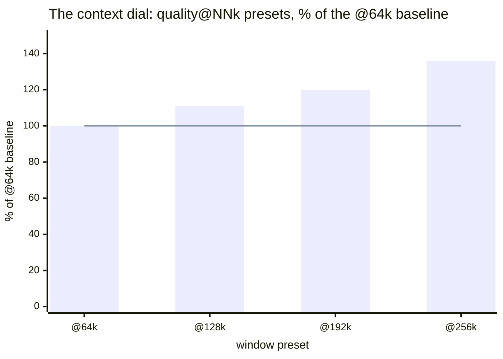
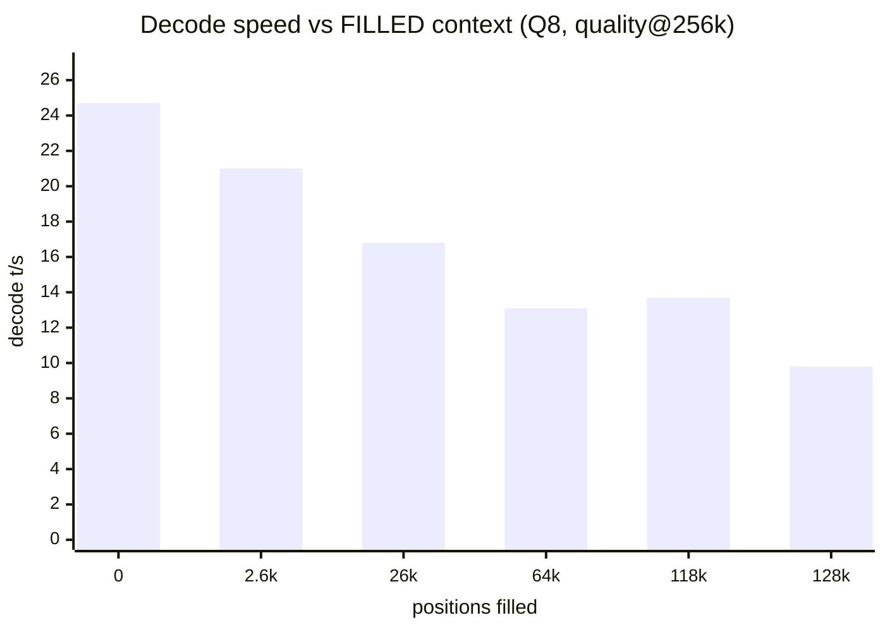
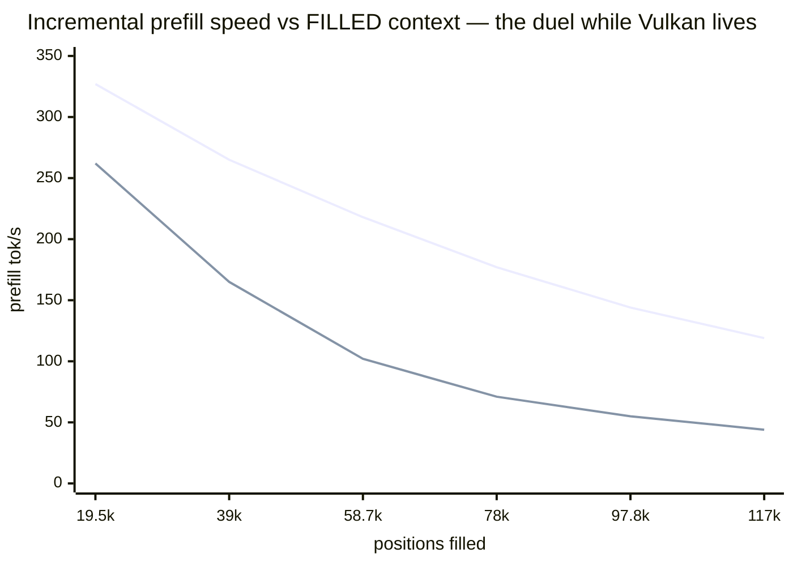

# Qwen3.8-27B on Strix Halo (Radeon 8060S / gfx1151)

> *Speed is useful, but quality is fundamental — one subtle bug fewer or a better
> codebase always pays for itself in wall-time gained.*

Run Qwen3.8-27B with the [strix-halo llama.cpp](https://github.com/Nathanw1014/strix-halo-llamacpp)
fork on a Ryzen AI MAX+ 395, with DFlash2 speculative decoding.

## Why this exists: cloud-free intelligence on a desk

If you are a solo developer with an AI agent working around the clock, a
privacy-sensitive operator, or any other entity that wants to be free from
cloud chains — read on. An all-purpose computer that cost **less than €2,000**
(launch offer) now serves a 27-billion-parameter reasoning model, entirely
from your own desk. Which machine? We tested on a **GMKtec EVO-X2** (Ryzen
AI MAX+ 395, 128 GiB) — [amazon.it/dp/B0F6X332N6](https://www.amazon.it/dp/B0F6X332N6/) —
any mini-PC or desktop with the same AMD Strix Halo APU works the same. **Not
affiliated**: no sponsorship, no free hardware, no affiliate links; we paid
for ours, and this repo links only to its own content.

- **No API keys, no quotas, no meters.** The model lives in your RAM
  (~122 GiB of it, mlock'd — the box's whole personality is inference).
- **Real speeds, measured**: 25–32 tokens/s sustained decode with DFlash2
  speculative decoding, ~330 t/s prefill; a five-recipe menu (quality /
  balanced / speed / vision / a context dial to a 256k-token window) you
  switch per request, like a reasoning level.
- **Sips power**: ~85 W sustained at full tilt — order of magnitude under a
  multi-GPU rig; idle cost roughly a lightbulb (~€0.04/night at €0.12/kWh,
  computed from the 85 W figure — verify against your tariff).
- **Private by physics**: prompts never leave the machine. No telemetry to
  disable, no retention policy to trust — unplugged is unambiguous.
- **Yours**: no deprecations, no price changes, no terms-of-service updates
  that quietly reshape your workflow. The stack is open source end to end.

The recipes, the numbers, and every trap we hit (there were many) are
documented below — so your agent can run 24/7 on hardware you own outright.

## Provenance note

> *Humans architected, verified, sealed. AI assistants built and wrote all the
delivered stuff.*

The architecture decisions, every acceptance of a
measurement, and the seal of each release were human; the builds, probes,
batteries, tables, and most of this documentation were produced by AI
assistants under that supervision — including this sentence. Every number in
this README traces to a command you can re-run.

## TL;DR — reproduce on any gfx1151 (Strix Halo) box

Six steps, ~45 min, no desktop environment needed (Arch minimal headless verified
end-to-end on a second box, 2026-08-21; Ubuntu may work, untested):

```bash
# 0. this repo (launchers, recipes, systemd unit, model downloader)
git clone https://github.com/PieBru/Qwen-3.8-27B_Strix-Halo_gfx1151 && cd Qwen-3.8-27B_Strix-Halo_gfx1151
# 1. deps (Arch; versions OBSERVED working: shaderc 2026.3, libdrm 2.4.134)
sudo pacman -S --needed base-devel cmake ninja git shaderc vulkan-headers \
  spirv-headers vulkan-icd-loader vulkan-radeon vulkan-tools libdrm
# 2. build the fork INSIDE the repo (llama.cpp/ is gitignored; or skip the
#    build: prebuilt v0.6.6 tarball — same commit, see Quick Start)
git clone https://github.com/Nathanw1014/llama.cpp && cd llama.cpp && git checkout strix-halo-vulkan
cmake -B build-vk -DGGML_VULKAN=ON -DCMAKE_BUILD_TYPE=Release -DGGML_NATIVE=ON -DLLAMA_CURL=OFF
cmake --build build-vk --target llama-server llama-cli llama-bench -j && cd ..
# 3. models — everything (targets + DFlash2 draft + vision mmproj), verified:
./download_models.sh            # ~73 GiB total; or pick: q6 q8 q5 draft mmproj
# 4. verify backend + bare perf (expect: Vulkan0 AMD 8060S; quiet box, f16 KV:
#    Q6 pp512 ~346 / tg32 ~8.6; Q8 pp512 ~366 / tg32 ~7.3 — zram churn can halve tg)
./build-vk/bin/llama-cli --list-devices
./build-vk/bin/llama-bench -m MODEL-UD-Q6_K_XL.gguf -ngl 99 -fa on -t 16 -b 4096 -ub 4096 -p 512 -n 32 -d 0,8192 -r 2
# 5. serve a preset (balanced = Q6 daily driver, ~29 t/s on a quiet box)
./run_llama-server.sh --goal balanced
curl -s localhost:8081/completion -H 'Content-Type: application/json' \
     -d '{"prompt":"Explain briefly why the sky is blue at sunset.","n_predict":64}'
```

Numbers are for an 85 W sustained PPT box; expect ±10% run-to-run. On the
Vulkan build, *filling* a window deep does not survive: prefill past ~128k
total positions **crashes** (`vk::DeviceLostError`; verified OK at 128,209
filled; death at 136,965 in the same-shape 2026-08-22 control) — plan ~128k of real content per session on
Vulkan. (ROCm/TheRock 7.15 build of the same commit: same-day A/B survived
215,228 filled positions — see
[Vulkan vs ROCm](#vulkan-vs-rocm-which-and-why) and
[the deep-positions A/B](#deep-positions-the-vulkan-wall-vs-rocm-survival).)
Once verified, pick your workload recipe from the
[**Recommended configs (per goal)**](#recommended-configs-per-goal) table.

## Headline findings (the counterintuitive ones)

Six results from this setup that invert what most LLM users expect — each
measured, each linked to its evidence:

1. **Context allocation is free; filling it is not.** Decode speed does not
   scale with the *allocated* window on this hybrid-SSM model — 28–30 t/s
   whether `c` is 32k or 256k (Q8: 24.7 vs 24.9). Most layers carry a
   constant-size recurrent state; only fill depth costs
   (~29 t/s at 8k filled → ~16–18 at 64–96k). Consequence: the
   `quality@64k…@256k` presets turn the window into a per-request dial that
   costs only RAM. Details in the
   [findings](#sweep-findings-at-a-glance) and the recipes-table notes.
2. **A lighter quant is *slower* here, not faster.** With speculative decode,
   Q4 (16.7 GiB of weights) decodes at 28 t/s vs Q5's 32 — quant noise
   collapses DFlash2 draft acceptance (0.647 → 0.41) and rejected drafts eat
   the bandwidth win whole. [Why Q4 was dropped](#ud-q4_k_xl-evaluated-and-dropped-2026-08-21--gguf-deleted-locally)
3. **Sampling penalties are poison for speculative decode.** A mild
   `repeat_penalty 1.05` costs **23–28% decode t/s** on every spec recipe —
   penalized logits stop agreeing with the draft (acceptance 0.647 → 0.450).
   Prefill is immune; use it per-request only. [Lesson #9](#lessons-learned)
4. **f16 KV is both faster *and* higher-fidelity here.** 128 GiB of unified
   memory inverts the usual trade: q8_0 KV measured slower than f16 (Q6 19.2
   vs 20.8 t/s) — so the quality choice is also the speed choice. And if you
   do need to shrink a window: retrieval survives KV quantization down to q4_0
   (40/40 needles, f16→q4_0, up to 96k). [Findings](#sweep-findings-at-a-glance)
5. **Two recipes = two full weight copies, even for the same GGUF file.**
   mmap shares the file pages, but each recipe's process uploads its own GTT
   weights copy — measured 41.0 → 71.5 GiB RAM when vision loaded next to
   balanced (same Q6 file). No flag or Linux trick dedups device memory
   across processes. (Concurrency note, [recipes](#recommended-configs-per-goal))
6. **Vision is free until the first image arrives.** Attaching mmproj costs
   ~nothing statically and text runs at full speed — but image tokens crash
   the DFlash2 speculative batch, so the vision recipe rides without spec
   decode (8.4 t/s vs 29 for the same weights). "It loads" ≠ "it works".
   [Lesson #7](#lessons-learned)

Also big, but limitation-shaped rather than surprise-shaped: the 1M-context
story (262k servable ceiling, measured RAM budget, three routes to 1M) has
[its own chapter](#the-1m-token-context-what-works-what-doesnt-and-what-it-costs).

## Quick start: run the prebuilt release (time-saving)

Skip the build entirely — the toolbox releases ship a portable, self-contained stack
(latest `v0.6.6`, `strix-halo-llamacpp-vulkan-portable.tar.gz`) that bundles its own
RADV + libdrm, so it won't touch the system driver and needs no compile toolchain:

```bash
curl -L https://github.com/Nathanw1014/strix-halo-llamacpp/releases/download/v0.6.6/strix-halo-llamacpp-vulkan-portable.tar.gz | tar xz
# the tarball's launcher self-sets the perf env; run its server directly with the
# preset flags (the repo's run_llama-server.sh hardcodes the local build path):
#   ./vulkan/llama-server -m <UD-Q6_K_XL.gguf> -md <DFlash2-Q8_0.gguf> -ngl all -fa on \
#       -c 65536 -b 4096 -ub 4096 --spec-type draft-dflash --spec-draft-n-max 6 --host 0.0.0.0
```

Verified on this box: the tarball pins commit `7b6c613`; the fork tip is
perf-identical within 1% (chat-parser-only delta since). Read on only if you want
to build from source.

## What's in this repo

Model weights (`.gguf`) and the `llama.cpp/` clone are local-only; this repo holds
the serving setup and notes:

- `run_llama-server.sh` — **unified launcher**: `--goal quality|balanced|speed`
  single-model presets, or `--router` to serve every recipe; every field overridable
  (`--model`, `--ctx`, `--nmax`, `--kv`, `--port`, `--draft`, `--no-mlock`, `--dry-run`;
  agent surface opt-in: `--agent`, `--tools`, `--mcp-config`, `--tools-runtime`;
  `--help` explains each)
- `models.ini` — the router recipes (the names in the table below)
- `llama-router.service` — systemd user unit (installs to `~/.config/systemd/user/`)
- `sharp.jinja` — fixed chat template for this model family (see Thanks)
- `download_models.sh` — **fetch the target GGUFs**: parallel-range downloads
  (~8× faster), sha256-verified against the table below, atomic install,
  tip-drift warning; `--check` re-verifies files already on disk
- `update_strix-halo-llamacpp_vulkan.sh` — pull/rebuild the fork + backend check
- `sweep_llama_configs.sh` — staged config search ([config research](#config-research-sweep_llama_configssh))

## Recommended configs (per goal)

| Goal | Router recipe (`models.ini`) | Command (`run_llama-server.sh …`) | context | RAM (GiB) | left (GiB) | tg (t/s) | pp4k (t/s) | PPL / KLD↑ |
|---|---|---|---|---:|---:|---:|---:|---:|
| **Quality @256k** | `Qwen38-27B-quality@256k` | router-only (Q8 @ 256k) | 262144 (servable ceiling) | ~61 | ~63 | ~25 | ~330 | 4.692 / ref |
| **Quality** | `Qwen38-27B-quality@64k` (+`@128k`, `@192k`) | `--goal quality` (Q8) | 65536 window; presets to 256k | ~45 | ~78 | ~25 | ~330 | 4.692 / ref |
| **Balanced** | `Qwen38-27B-balanced` | `run_llama-server.sh` (Q6) | 131072 window (agentic-sized); flat to 256k | ~42 | ~80 | **~29** | ~306 | 4.706 / 0.0073 |
| **Speed** | `Qwen38-27B-speed` | `--goal speed` (Q5, n-max 5) | 65536 | ~35 | ~88 | **~32** | ~297 | 4.722 / 0.0137 |
| **Vision** | `Qwen38-27B-vision` | router-only (mmproj, no spec) | 65536 | ~32 | ~91 | ~8.4 | — | 4.706 / 0.0073 |

**The context dial.** All `quality@NNk` presets are the same weights, quality
and decode speed — allocation is free (headline #1), so `NN` buys only the
window and its RAM price (~45 → ~61 GiB from @64k to @256k). Switch presets
per **request**, even mid-session: standard clients resend the full history
every call, so the new preset's first request rebuilds ("renews") the context
after one ~6–15 s on-demand load — verified with a needle set on @64k and
recalled on @192k. For fully-local users this makes the context window a
dial much like the reasoning-level switch (none/low/medium/high), trading
free RAM for window on the fly; `--models-max 1` serializes the switch (the
old preset unloads first — switch between requests, not during one).



Bars = RAM occupied; line = decode speed (quality is likewise flat) — the window
costs memory and nothing else. (Fill-depth decay, above, is the separate price
of actually *using* the window.)
**Two measured realities temper the dial** (fill battery 2026-08-21, Q8,
f16 KV, chunked incremental fill): decode falls with FILLED depth —
**24.7 t/s fresh → 13.1 @64k → 9.8 @128k filled** (incremental prefill
likewise: ~218 → ~113 t/s from 32k to 96k depth) — and content beyond
**~128k positions crashes the Vulkan path even for incremental fills**
(128,209-token fill OK; ~160k `vk::DeviceLostError` — a same-day control
re-run pinned the actual death at **136,965** filled). So `@64k…@128k` are
fully usable presets; `@192k`/`@256k` are allocation headroom until deep
positions are fixed — plan sessions around ~128k of real content.

Measured decode vs fill (`quality@256k`, Q8, temp 0; both reference frames
shown — of the 262,144-token window, and of the ~128k usable-content ceiling):

| Positions filled | % of 256k window | % of ~128k usable | decode tg (t/s) |
|---:|---:|---:|---:|
| 12 (fresh) | 0% | 0% | 24.7 |
| 2,622 | 1% | 2% | ~21 |
| 26,394 | 10% | 20% | 16.8 |
| 65,536 | 25% | 50% | 13.1 |
| 118,212 | 45% | 90% | 13.7 |
| 128,209 | 49% | 98% | 9.8 |
| ~160,000 (fill target) | 61% | — (past ceiling) | 💥 died en route |

Not linear: fast decay in the first quarter, a ~13–14 t/s plateau through
the middle band, a further drop approaching the ceiling, then the hard wall.



The wall is not chartable: the ~160k-target fill died en route with
`vk::DeviceLostError` (child crash, router wedge; a same-shape 2026-08-22
control pinned the death at 136,965) — the table row above marks it.

When to pick which:

- **Quality @256k** — the flagship window: the servable ceiling, for many/long
  contexts (NOT one ≥128k-position prompt — Vulkan prefill ceiling); loads can
  be slow on an uptimed box. Same weights/quality/speed as Quality @64k — the
  difference is purely RAM for window (see the context-dial note above).
- **Quality (@64k) — correctness-first answers, code, synthesis; the
  `@128k`/`@192k`/`@256k` presets are one model-field away when the window is
  needed — pick your standing window by your own usage.
- **Balanced** — the all-rounder: best quality/speed balance
  (28.1–29.6 t/s across the whole 32k–256k ladder). Default window 128k: sized
  for agentic coding sessions — the primary Qwen3.8-27B workload — at ~+4 GiB
  RAM over 64k and zero decode cost, while staying inside the measured-safe
  ~128k content ceiling (the window itself keeps sessions out of the crash
  zone).
- **Speed** — fastest decoder: +10% tg and ~5 GiB lighter than balanced, at the
  documented quality cost (see the PPL/KLD columns) — churn and prototyping.
- **Vision** — the only image-capable recipe (mmproj, no spec decode — lessons
  #7); lightest resident footprint.
- **Max context** — superseded by **Quality @256k** (same recipe, clearer
  name); the separate-recipe rationale — per-request window choice — is now
  the whole `quality@NNk` dial.

Notes on the columns:

All presets: DFlash2-Q8_0 draft, f16 KV, n-max 6 (turbo: 5), `-b/-ub 4096`, `-t 16 -tb 32`,
`-lm mmap+mlock`, sharp.jinja template, metrics on. tg = sustained decode on a quiet
box; fresh-load peaks run higher. **RAM** = resident footprint vs idle router
(weights + draft + KV + compute buffers; mlock'd, never swapped), **left** = `free`
"available" with that recipe live — headroom for concurrent models/activities.
Measured 2026-08-21 on a 124 GiB box via the router; variance ±1–2 GiB.

tg was measured fresh-slot (first task after load), temp-0. Decode is flat
across ctx ALLOCATION for every recipe (Q6 ladder 32k→256k: 28.1–29.6 t/s;
Q8: 24.7–24.9) — the hybrid-SSM architecture gives most layers a constant-size
state, so an allocated-but-unfilled window costs nothing. What DOES cost
is how much of the window is FILLED — measured on Q8 (fill batteries
2026-08-21, quality@256k): **24.7 fresh → ~21 @2.6k → 16.8 @26k → 13–13.7
@64–118k (plateau) → 9.8 @128k → vk::DeviceLost at ~137k (2026-08-22 control)** (the few
full-attention layers scan the filled KV per token; incremental prefill
decays similarly).
So `~25` is the short-prompt benchmark — a filled long-window session decodes
at roughly half speed or less. Context buys RAM (+~10 GiB per 3×) and load
time, not sustained tg at depth. And spec-decode t/s is **content-dependent**:
the same model spans ~16–38 t/s across prompt styles (DFlash2 acceptance
0.28–0.91 — narrative continuation drafts well, structured enumeration less);
table values use one standard probe for comparability. Cross-verified on two
identical APUs (dev 37.4/16.4 vs clean box 37.7/20.4 on the same prompts). Served defaults
are sampling-penalty-free.
⚠️ Opting into `repeat_penalty 1.05` costs **23–28% decode on every spec recipe**
(it collapses DFlash2 acceptance 0.647 → 0.450); prefill and vision are immune.
Use it per-request, only when repetition actually bites — lessons #9.

PPL / KLD↑ (`llama-perplexity`, 200×512-token chunks of a local docs corpus; use for
internal ranking only — absolute values are corpus-specific). KLD = KL divergence of
the token distribution vs the `UD-Q8_K_XL` reference logits; top-p agreement with the
reference: Q8 100% (is the reference), Q6 96.5%, Q5 95.5%. PPL depends only on the
weights — recipes sharing a quant share these values; spec decode, mmproj, ctx and
penalties don't enter.

**Everything relative to the `quality@64k` baseline** (UD-Q8_K_XL v3.0,
64k window — pick your own reference frame; values are % of that row):

| Recipe | context | RAM occupied | tg | pp4k | PPL | KLD (absolute¹) |
|---|---:|---:|---:|---:|---:|---:|
| `quality@64k` (baseline) | 100% | 100% | 100% | 100% | 100% | 0 (reference) |
| `quality@128k` | 200% | ~111% | 100% | 100% | 100% | 0 |
| `quality@192k` | 300% | ~120% | 100% | 100% | 100% | 0 |
| `quality@256k` | 400% | ~136% | 100% | 100% | 100% | 0 |
| `balanced` (Q6 @ 128k) | 200% | ~93% | 116% | 93% | 100.3% | 0.0073 |
| `speed` (Q5) | 100% | ~78% | 128% | 90% | 100.6% | 0.0137 |
| `vision` (Q6, no spec) | 100% | ~71% | 34% | — | 100.3% | 0.0073 |

¹ KLD (KL divergence vs the Q8 reference logits) is shown **absolute** — as a
percentage of the baseline it is undefined: the baseline *is* the reference,
so its own KLD is 0 by construction. Lower is better.

Reads: the four quality presets trade only context↔RAM (speed and quality
untouched — the dial); balanced buys 2× context at −7% RAM and +16% decode
for a 0.3% PPL cost; speed stays at the baseline window and pushes +28%
decode / −22% RAM for 0.6% PPL; vision is the RAM featherweight at 34%
decode. Fill-depth decay not included — these are short-prompt benchmarks
(see the tg note above).

Heads-up for concurrency: `--models-max 1` is policy, not a hard memory limit —
two small recipes would *fit* (e.g. speed + balanced ≈ 75 GiB), but three resident
models exhausted memory and hard-hung the box, so 1 stays the default; raise only
with verified headroom. Note there is **no weight sharing between recipes**: two
recipes pointing at the same GGUF (e.g. balanced + vision, both Q6) each upload
their own copy — measured 41.0 → 71.5 GiB RAM and 37.2 → 67.1 GiB GTT when the
second one loaded. The duplicate is the per-process Vulkan GTT allocation, not
the file cache — mmap already shares the file pages (the RAM delta ≈ the GTT
delta; no second file copy appears), and no llama-server flag or Linux knob
(KSM can't see driver shmem) dedups device memory across processes. Concurrent
same-weights recipes therefore always cost a full extra copy; the alternative
is the current `--models-max 1` serialization (~6–13 s reload on switch). At boot
only **balanced** loads (`load-on-startup = true` in its models.ini section — the
one recipe allowed under `--models-max 1`); every other recipe's **first request
pays a one-time load** (~6 s warm, up to ~13 s from cold page cache), and switching recipe
names under `--models-max 1` unloads the previous one first, paying the same load
again — steady-state serving after that is instant.

Decision rule: **Q8 when quality is the point, Q6 when tokens/s is** — prefill is
equal (~250–330 pp4k), decode favors Q5-turbo > Q6 > Q8 at every context size.

## Running it

Single model with a preset (any field overridable, `--help` for all):

```bash
./run_llama-server.sh --goal balanced            # Q6 @ 128k — daily driver
./run_llama-server.sh --goal quality             # Q8 @ 64k — correctness first
./run_llama-server.sh --goal speed              # Q5 @ 64k — fastest decoder
./run_llama-server.sh --goal quality --ctx 196608  # Q8 with a bigger window
./run_llama-server.sh --model q8 --kv q8_0 --nmax 4   # fully custom
./run_llama-server.sh --router --agent              # WebUI agent: all tools + MCP proxy
./run_llama-server.sh --router --tools all --tools-runtime docker:alpine  # sandboxed
```

### Serving all recipes (the router)

One port, every recipe from the table, loaded on demand:

```bash
./run_llama-server.sh --router --port 8080              # foreground
# or as a boot-persistent user service — substitute in the pipe (keeps your
# clone clean for future git pulls; run from the repo root):
mkdir -p ~/.config/systemd/user
sed "s|/REPLACE/WITH/YOUR/REPO/PATH|$(pwd)|" llama-router.service \
    > ~/.config/systemd/user/llama-router.service
systemctl --user daemon-reload && systemctl --user enable --now llama-router
sudo loginctl enable-linger $USER   # run the user manager (and the router) at
                                    # BOOT, with nobody logged in — without this
                                    # a headless box starts no router

curl -s localhost:8080/v1/chat/completions -H 'Content-Type: application/json' \
     -d '{"model":"Qwen38-27B-balanced","max_tokens":64,
          "messages":[{"role":"user","content":"hi"}]}'
```

#### Tip: `Qwen38-27B` — the movable "default model" alias

`models.ini` pins one stable client-facing name, `Qwen38-27B`, on the balanced
recipe (`LLAMA_ARG_ALIAS = Qwen38-27B`). Point clients at **that** name instead
of a recipe name, and changing your mind about which recipe is "the default"
becomes a one-line move — no client reconfiguration:

1. In `models.ini`, move the `LLAMA_ARG_ALIAS = Qwen38-27B` line from
   `[Qwen38-27B-balanced]` to your preferred section (e.g. `[Qwen38-27B-speed]`).
2. Move the `load-on-startup = true` line with it, so the boot-preloaded
   recipe stays your default (only ONE recipe may carry it: `--models-max 1`).
3. Restart the router (`systemctl --user restart llama-router`) — the alias
   re-registers at startup and the new default re-preloads at boot. A
   `?reload=1` is NOT enough: the router re-reads presets only for recipes
   that aren't running, so moving an alias off a loaded recipe needs the
   restart.

Everything pinned to the alias — pi's `local` provider (`models.json`), the
WebUI's saved model, cron/curl scripts, other boxes on the LAN — silently
follows the move; the recipe names stay available for when you explicitly
want a different tradeoff.

### Running 24/7 agents: the margin rule

The window (`c`) is a **fence**, not a target. A prompt larger than the window
is rejected with a clean HTTP error — agent frameworks compact and retry, the
service never notices. A prompt *under* the window gets prefilled — and past
~128k–160k positions prefill crashes the GPU child and wedges the router
(observed; manual restart needed). So for a coding agent that manages its own
context:

- **agent soft ceiling ≈ 96k** (keeps sustained decode in the ≥13 t/s band and
  leaves burst room for one huge tool output),
- **window stays 128k** — the hard fence that converts "agent missed its
  ceiling" into a graceful compact-and-retry,
- **never** widen the window to "give the agent margin" (e.g. 192k): that
  moves the fence past the crash band, so a runaway request dies at the GPU
  instead of being rejected. The margin must live *below* the window.

### How the primary author actually runs it (one operator's profile)

Not a recommendation — an example of mapping the menu to a workflow:

- **Interactive / keyboard-driven work → `balanced`.** The Q6 daily driver:
  ~29 t/s sustained feels instant against typing speed, quality is plenty for
  code review and editing loops, and the 128k window never gets in the way of
  an interactive session (which rarely fills a quarter of it).
- **Nightly / unattended agent batches → `quality@128k`, agent ceiling 100k.**
  Q8 for max quality on long autonomous runs; the window at 128k and the
  agent's own context budget at 100k implement the margin rule above — the
  agent compacts well before the fence, and a buggy run that misses its
  ceiling is rejected at 100k–128k and retries, never reaching the crash band.

The split costs nothing to switch between: it's one model name in the client,
with `--models-max 1` doing the load swap (~6–15 s) between request batches.

Recipe names are plain roles — `Qwen38-27B-quality@64k…@256k | -balanced |
-speed | -vision`. No extra aliases are registered (they only clutter the
llama-server WebUI model picker); older names from this repo's history
(`-turbo`, `-fast`, `-Q8-192K-quality`, …) no longer resolve — update clients
to the role names.
Recipe-specific keys
(weights, ctx, spec config, mmproj) live in `models.ini` sections — see the header
of that file for the key reference and the CLI-vs-section precedence rule (lessons #8).

## Test — verify GPU, not silent CPU fallback

The headline failure mode in BUILD.md: a Vulkan ICD manifest without `api_version`
gets skipped by the loader and llama.cpp **silently falls back to CPU** (~7x slower).
Not an issue with the system RADV, but always confirm the backend:

```bash
# backend must read GPU/Vulkan (AMD Radeon 8060S), not CPU
./build-vk/bin/llama-cli --list-devices
./build-vk/bin/llama-bench -m <model.gguf> -ngl 99 -fa on -t 16 -b 4096 -ub 4096 -p 512 -n 32 -d 0,8192 -r 2
```

Quiet-box reference for that bench command (f16 KV): Q6 pp512 **~346** / tg32
**~8.6**; Q8 pp512 **~366** / tg32 **~7.3**; shallow pp512 varies ±10% run-to-run at
85 W. Note `llama-bench` measures bare decode only — it takes most server flags but
not `-md`/`--spec-*` (no draft support), so spec-decode gains don't show here.

## Sweep findings at a glance

How these were measured: [config research](#config-research-sweep_llama_configssh).

| Axis | Winner | Evidence |
|---|---|---|
| KV type (target & draft) | **f16 / f16** | f16 is faster than q8_0 on both models (Q6 20.8 vs 19.2, Q8 16.6 vs 15.6 t/s) and higher fidelity — 128 GB unified makes it free |
| KV quantization for long windows | **f16 default; q8_0 when the window is the point** | NIAH battery 2026-08-21 (two random codes at 25%/75% depth, 8k/32k/64k/96k ctx, f16→q4_0): **40/40 retrieved** — positional retrieval survives q4_0 even at 96k. Decode flat across types (26.6–29.6 t/s); only memory drops (~3.3 GiB GTT per 110k ctx f16→q8_0, ~5.0 f16→q4_0, ×~9.5 at 1M) |
| `--spec-draft-n-max` | **6** | 6–7 plateau, 4 clearly worse (DFlash2 `block_size=8, n_extract=5`); Q6: n6 28.6 > n5 27.4 > n4 24.8 |
| `-c` allocated ctx | **65536 default; allocation is free up to 256k** | decode flat 64k–256k (Q6 20.2 ±0.2 t/s, Q8 ~17.6); the ≥128k crash is deep-prefill-only, not an allocation limit |
| `-b/-ub` | **4096** | tg flat ±2% across 2048/4096/8192; 4096 = +6% deep prefill over 2048; 8192 doubles compute buffers for nothing |
| `-tb` | **32** | tb16 within ~1% — GPU-bound |
| Model choice | **Q6 speed / Q8 quality** | decode favors Q6 at every ctx; Q8 prefill edges Q6 (pp512 366 vs 346 — Q8_0's symmetric blocks ride the fast kernel path). Q4 was evaluated and dropped — acceptance collapse, see Models |
| Host state | **`-lm mmap+mlock`** | zram-swapped weight pages cost up to ~30% decode; mlock makes weights unswappable |
| dflash fine-tuning | **inert beyond n-max** | `spec-draft-n-min` 2/3 and `spec-draft-p-min` 0.3/0.9 change nothing (bit-identical decodes, acceptance 0.647); stacking `ngram-map-k` on dflash *hurts* (29.0 → 27.4 t/s). Draft quality sets acceptance — `n_max` is the only working knob |
| `--kv-unified` | **no effect at `-np 1`** | measured 2026-08-21 on Q6@64k and Q8@192k (journal-confirmed `kv_unified='true'`): tg and RAM identical within noise. Its purpose is sharing one KV buffer across parallel slots; with a single slot (and the hybrid SSM's tiny KV) there is nothing to unify. It flips on by itself if slots ever go auto |

## The 1M-token context: what works, what doesn't, and what it costs

Qwen3.8-27B's 1M-token window is a headline feature — here is everything this
repo measured about it on a Strix Halo (gfx1151) box, in one place.

**The promise.** The model card declares 262,144 native context, "extensible
up to 1,000,000 tokens" via YaRN (factor 4.0 from the 262,144 training ctx),
and the publisher's long-horizon guidance budgets 262k reasoning + 131k output
*inside* the 1M window. Important framing: positions beyond 262k are
YaRN-extrapolated, not trained — endorsed by the publisher, but expect gradual
quality decay as you climb past 256k, on every server.

**What this stack serves today: `quality@256k` at 262,144.** That number is the
model's `n_ctx_train`, and llama-server caps every slot to it — a cap inherited
from **mainline llama.cpp itself** (identical code verified in a stock clone),
with no YaRN exemption. We load-tested a full 1M recipe
(`rope-scaling = yarn`, `rope-scale = 4`, `yarn-orig-ctx = 262144`,
`c = 1048576`): the KV allocated fine, then the journal printed the cap warning
and the usable slot came back at 262,144 — full memory cost, zero extra window.
The same test showed there is **no 512K middle ground**: the cap applies to any
`c` above 262,144, so 512K would pay ~18 GiB more KV than 256k and still serve
a capped slot. Separately, even inside a 262k window, content beyond
**~128k positions** hits the Vulkan `vk::DeviceLostError` — and this is an
**absolute-position** limit, not a per-batch one: chunked/incremental fills
crash at the same depth (measured: 128,209-token fill OK, ~160k crash). Big
windows are for many medium contexts, not one giant prompt — and on the Vulkan
build not for more than ~128k of content at all (the ROCm build survives this
band — next subsection).

### Deep positions: the Vulkan wall vs ROCm survival

A/B measured 2026-08-22 on the same box, same fork commit (`9b9ac3e38`),
same battery (`fill_battery.sh`: Q8 target + DFlash2 draft, f16 KV,
`-c 262144 -b/-ub 4096`, incremental 16k-token fills via cached prefixes):

| Backend | bare bench (Q6 / Q8) | fill fate |
|---|---|---|
| Vulkan (production build) | pp512 360.6 / 365.0 · tg32 8.78 / 7.27 | 💥 died at **136,965** filled (`vk::Queue::submit: ErrorDeviceLost`, RADV "CS cancelled") |
| ROCm — TheRock 7.15.0a nightly | pp512 352.5 / 370.8 · tg32 8.57 / 7.18 | ✅ **survived 215,228** filled, zero errors |

Reading it straight:

- **The ~128k+ wall is a Vulkan-path bug, not the model or the hardware.**
  Same weights, same flags, same commit — only the backend differs.
- **Vulkan stays the faster deep-prefiller while it lives**: incremental fill
  177→144→119 t/s at 78k→98k→117k filled, vs ROCm's 72→55→44 t/s in the same
  band (ROCm decays faster with depth: 262 t/s at 20k → 28 t/s at 176k).
- **DFlash2 works on ROCm**: draft acceptance 0.34 on a matched probe; decode
  14.5 t/s vs Vulkan's 16.9 t/s (Q6@128k) — Vulkan ~17% ahead with spec decode.
- Upstream status (2026-08-22): the Vulkan device-lost class is still open
  upstream ([#27076](https://github.com/ggml-org/llama.cpp/issues/27076),
  [#27458](https://github.com/ggml-org/llama.cpp/issues/27458)); the fork's
  [issue #9](https://github.com/Nathanw1014/strix-halo-llamacpp/issues/9)
  shows a 491,520-token prefill *succeeding* on Vulkan with DeepSeek-V4 +
  q8_0 KV + `-ub 1024` — the wall is config-shaped, and the suspects are
  f16 KV at depth, `-ub 4096`, and this model's full-attention layers.

**To try the ROCm build yourself** (no root needed; userspace-only, sits
beside the Vulkan one):

```bash
# TheRock nightly for gfx1151 (fixed line — the 7.14.0a20260609..0612 wheels
# segfault in hsa_init on gfx1151; see TheRock issue #5763)
curl -O https://rocm.nightlies.amd.com/tarball-multi-arch/therock-dist-linux-gfx1151-7.15.0a20260728.tar.gz
mkdir -p ~/opt/rocm-7.15 && tar -xzf therock-dist-linux-gfx1151-*.tar.gz -C ~/opt/rocm-7.15
export ROCM_PATH=~/opt/rocm-7.15 PATH=$HOME/opt/rocm-7.15/bin:$PATH LD_LIBRARY_PATH=$HOME/opt/rocm-7.15/lib
cmake -B build-hip -DGGML_HIP=ON -DAMDGPU_TARGETS=gfx1151 -DCMAKE_BUILD_TYPE=Release \
      -DGGML_NATIVE=ON -DLLAMA_CURL=OFF \
      -DCMAKE_C_COMPILER=$ROCM_PATH/bin/hipcc -DCMAKE_CXX_COMPILER=$ROCM_PATH/bin/hipcc
cmake --build build-hip --target llama-server llama-bench -j
# then run any recipe with build-hip/bin/llama-server instead of build-vk —
# and ./fill_battery.sh <label> ./llama.cpp/build-hip/bin/llama-server to
# reproduce the deep-fill A/B
```

For official-release ROCm (7.2.4 era), expect the "way slower than Vulkan"
reports to hold — upstream tracks the gfx1151 gaps
([#21284](https://github.com/ggml-org/llama.cpp/issues/21284),
[#24437](https://github.com/ggml-org/llama.cpp/issues/24437)); the 7.14+/TheRock
line is where parity arrives. Until the Vulkan fix lands, **ROCm is the
deep-context escape hatch: slower prefill at every depth (1.25–2.7×), but it
doesn't die.**

**What 1M costs in memory** (Q6 targets; f16 measured on a real 1M load, the
rest derived from GTT deltas at 110k ctx scaled linearly — the derivation
reproduces the f16 measurement within ~3%):

| KV type | GTT at 1M ctx | verdict on this 124 GiB box |
|---|---:|---|
| f16 | ~104 GiB (measured 100.9; RAM avail 14.3 GiB) | cliff edge — barely |
| q8_0 | ~72 GiB | comfortable ✅ |
| q5_1 | ~63 GiB | comfortable |
| q4_1 / q4_0 | ~57 / ~56 GiB | comfortable |

A Q8 target adds ~7 GiB (q8_0 ≈ 80 — fits; f16 does not). Is quantized KV safe
at long range? Yes: the NIAH battery ([findings](#sweep-findings-at-a-glance))
retrieved **40/40 needles from f16 down to q4_0 at up to 96k ctx** — KV
quantization does not break positional retrieval on this stack. That is why
the parked 1M recipe pins q8_0.

**How to actually get 1M today:**

1. **vLLM on this very APU** — officially supported: vLLM's install docs list
   `Ryzen AI MAX / AI 300 Series (gfx1151/1150)` (ROCm 7.0.2+), and vLLM serves
   YaRN with PagedAttention. Costs: no GGUF support (separate HF/AWQ weights,
   new fingerprints), DFlash2 spec decode is llama.cpp-only (the model's trained
   MTP head may recover speed via vLLM's own spec paths — unverified), and the
   memory budget above still applies.
2. **A local cap-exemption patch** — we build the fork from source; skipping
   the clamp when YaRN is active is a few lines and would make the parked
   `Q6-1M-yarn` recipe live (single prompts still capped ~128k by the prefill
   ceiling; the *window* would work).
3. **Wait for upstream** — a llama.cpp PR exempting YaRN from the slot cap,
   plus the deep-prefill fix. Note the fork→mainline merge does **not** lift
   the cap (mainline has the same code); detection after any rebuild is a
   5-second journal grep: load the parked recipe and check that the
   `exceeds the training context - capping` warning is absent and
   `n_ctx_slot = 1048576`.

Everything needed for the day it unlocks is parked and ready at the bottom of
`models.ini`: the full 1M recipe (q8_0 KV — NIAH-validated), the RAM budget
above, and the two blockers documented inline.


## Vulkan vs ROCm, which and why?

Two GPU backends can drive the 8060S on Linux: **Vulkan** (via Mesa RADV — what
this repo ships by default) and **ROCm/HIP** (AMD's compute stack). On Strix
Halo the internet folklore says "ROCm is way slower than Vulkan" — that was
true for the *official* ROCm releases (7.2.x era) but is **no longer true for
the 7.14+/TheRock line**, and we measured it. This chapter is the plain-language
tour of what we ran, what died, and what we now run for which job.

### What we actually compared (all on this box, same models)

Every number below comes from the same experiment rig: identical fork commit
(`9b9ac3e38` unless noted), identical models (Q8 target + DFlash2 draft, f16 KV,
`-c 262144 -b/-ub 4096 -fa on`), identical battery
([`fill_battery.sh`](fill_battery.sh) — grows the context in 16k-token chunks
through cached prefixes, i.e. true incremental fill). Only the backend — or the
build — changes between rows. The A/B CSVs, server logs, and the 16k-token
fill corpus are committed under `results/` (the repo's `.gitignore` hides the
full ~80-file research tree; only the evidence set is versioned).

**The four builds we tested:**

1. **Fork, Vulkan** — our production build (the strix-halo-vulkan fork's tuned
   Vulkan path: coopmat matmuls, wave32, LDS pad tuning).
2. **Fork, ROCm** — same fork commit, HIP backend, built against **TheRock
   7.15.0a nightly** (AMD's rolling source releases; userspace-only, no root).
3. **Stock upstream master, Vulkan** — plain `ggml-org/llama.cpp` at `2115b73`
   (2026-08-22), to answer "maybe the newest upstream already fixed it?"
4. **Fork HEAD, Vulkan** — the fork's newest commits (incl. a fresh Vulkan
   coopmat-pad gating fix), to answer the same for the fork.

### The speed picture

Bare bench (`llama-bench`, pp512 = prompt processing, tg32 = generation):

| Build | Q6 pp512 | Q6 tg32 | Q8 pp512 | Q8 tg32 |
|---|---:|---:|---:|---:|
| Fork Vulkan (production) | 360.6 | 8.78 | 365.0 | 7.27 |
| Fork ROCm TheRock 7.15 | 352.5 | 8.57 | **370.8** | 7.18 |
| Stock master Vulkan | 316.9 | 8.78 | — | — |

Decode with speculative decoding (Q6 @ 128k, fresh context, n=3 probes per
cell, medians with min–max; raw rows in
[`results/spec-battery-n3.csv`](results/spec-battery-n3.csv)):

| Combination | sustained decode | draft acceptance |
|---|---:|---:|
| Vulkan + DFlash2 | **16.7 t/s** (16.57–16.91) | 0.29 |
| Vulkan + MTP | 15.1 t/s (14.85–15.12) | 0.32 |
| ROCm + MTP | 14.5 t/s (14.48–14.59) | 0.33 |
| ROCm + DFlash2 | 14.2 t/s (14.07–14.32) | 0.34 |

*Probe shape: fresh context, short prompt, 256 generated tokens. Draft
acceptance sits ~0.3 on this shape vs ~0.38 on real router traffic, which is
why the intro's 25–32 t/s production figures are higher. The ranking is the
point of this table, not the absolutes.*

Read it straight: **on the TheRock 7.15 line, ROCm reaches parity** (Q8 prefill
even ahead) — the "way slower" folklore belongs to the official 7.2.x releases
(upstream tracks those gaps: [#21284](https://github.com/ggml-org/llama.cpp/issues/21284),
[#24437](https://github.com/ggml-org/llama.cpp/issues/24437)). With
speculation armed, Vulkan+DFlash2 stays the fastest combination; MTP is viable
everywhere and actually *prefers* ROCm here. (halofpx's much higher MTP numbers
come from a 13.5 GiB FP4 quant — half our weights; see the comparison below.)

### The stability picture — where the ~128–160k wall actually lives

Same battery, deep fill, fate of the server:

| Build | filled positions at death | signature |
|---|---:|---|
| Fork Vulkan (production pin) | **died at 136,965** | `vk::Queue::submit: ErrorDeviceLost` |
| Fork HEAD Vulkan | died in the 117k–137k band | same |
| Stock master Vulkan (`-ub 4096`) | **died at 19,571** (!) | same |
| Stock master Vulkan (`-ub 1024`) | died in the 39k–58k band | same |
| Fork ROCm TheRock 7.15 | **survived 215,228 filled — zero errors** (two runs: run 1's chunk-12 client-timeout cancelled at 98% progress ≈ 234k filled server-side; run 2 stopped manually mid-chunk-10 — server healthy both times) | — |

*Note on the stock rows: they ran without a draft model — stock's loader
rejects the fork-format DFlash2 draft (`wrong number of tensors; expected 81,
got 58`, [log](results/stock-dflash-loadfail.log)) — so stock-vs-fork differs
in build **and** spec path; the fork-HEAD row is the clean same-spec
comparison.*

Three findings worth internalizing:

- **The wall is a Vulkan-path bug, not the model or the hardware** — same
  weights, same flags, same commit; only the backend flips death into survival.
- **Bleeding edge does not fix it (yet)**: neither upstream master nor the
  fork's newest commits move the needle. In fact **stock master is 7× worse**
  than our fork build — the fork's tuned Vulkan path is what carries you from
  ~20k to ~137k. Do not swap our build for stock on this APU.
- **The crash is config-shaped, not absolute**: `-ub 1024` stretched stock's
  life 2–3× (and a fork user prefilled 491,520 tokens on Vulkan with q8_0 KV +
  `-ub 1024` on DeepSeek-V4 — [fork issue #9](https://github.com/Nathanw1014/strix-halo-llamacpp/issues/9)).
  Suspects: f16 KV at depth, the 4096 microbatch, and this model's few
  full-attention layers. Upstream still has the class open
  ([#27076](https://github.com/ggml-org/llama.cpp/issues/27076),
  [#27458](https://github.com/ggml-org/llama.cpp/issues/27458)).

### The chart: context-filling decay, deep into the 256k window

Prompt-processing speed while the context fills (the same 16k chunks, same
flags; Q8 + DFlash2 + f16 KV). **Vulkan's prefill edge widens with depth
(1.25× at 20k → 2.7× at ~117k) — until it dies mid-band.** ROCm decays faster
in absolute terms but is the only one still standing (measured to 215k = 82%
of the 262k window):



*(upper line = Vulkan — it died one chunk past the last point shown, at
136,965 filled; lower line = ROCm TheRock 7.15, which kept decaying smoothly
through the death zone: 37 t/s @137k → 32 @156k → 28 @176k → 25 @196k →
22 @215k — zero errors, measured to 215,228 = 82% of the window. Two
independent runs reproduced the ROCm curve within ±3% at every depth.
Decode speed decays with filled depth on both backends the same way — see the
fill-decay table in the 1M chapter.)*

### So which one, and why?

- **Daily driving (≤ ~100k of content): stay on Vulkan.** Faster decode with
  DFlash2 (16.7 vs 14.2 t/s), 1.25–2.7× faster prefill by depth, one build, zero extra
  setup — that's what `run_llama-server.sh` and the recipes assume.
- **Deep-context escape hatch: the ROCm build.** When a session genuinely
  needs > ~128k of *filled* context today, swap the binary — same models, same
  flags, same recipe file — and it does not die. Slower prefill at every depth
  (1.25–2.7×), but alive. Build recipe in
  [the deep-positions A/B](#deep-positions-the-vulkan-wall-vs-rocm-survival).
- **Watch, don't switch, on stock upstream** — its Vulkan path is strictly
  worse on this APU today (and its `draft-dflash` loader can't even read the
  DFlash2 draft: "wrong number of tensors; expected 81, got 58" — the selector
  format is fork-specific).
- **MTP is the portable speculation option** (works on both backends, no
  separate draft weights), but on Vulkan DFlash2 beats it 16.9 vs 13.1 t/s —
  keep DFlash2 where it works, MTP where it doesn't.

### How this compares with halofpx as of 2026-08-22

Repos compared at this date: **halofpx** [`22dd3b54d`](https://github.com/julianmb/halofpx/commit/22dd3b54d)
("feat(registry): mandatory quant provenance metadata" — they have started
requiring quant provenance metadata, a step in the right direction) vs **this
repo** [`5569eb2`](https://github.com/PieBru/Qwen-3.8-27B_Strix-Halo_gfx1151/commit/5569eb2)
(the commit carrying the experiments above; you are reading its descendant).
halofpx moves fast — re-check their numbers against their own current tip
before relying on them.

[halofpx](https://github.com/julianmb/halofpx) is the speed-first cousin of
this repo: a slick model-zoo server for Strix Halo built around hand-tuned
**ROCmFP4/FP8 quants**, MTP, and a Vulkan-decode + ROCm-prefill split. We
measured nothing against it on this box (its weights are a separate download);
this is a methodology comparison from their published numbers:

- **Their speed is real but bought with quantization.** Their Qwen3.8-27B
  default (`ROCmFP4_FAST`, 13.55 GiB, 4.26 bpw) decodes at 14.0 t/s bare /
  30.6–36.0 t/s with MTP. Half-size weights on a bandwidth-bound APU *should*
  be ~2× faster — that's the trade, not magic. Our Q6/Q8 recipes trade that
  speed away for fidelity.
- **Quality verification is thin where it matters.** Their published
  perplexity is one number for *Ornith* (5.95 vs Q4_K_M's 5.64 — and the ±0.3
  error bars nearly touch), measured on **9 chunks of wikitext-2 at n_ctx=512**
  (~4.6k tokens). No perplexity is published for the Qwen FP4_FAST default at
  all, and **no KLD-vs-reference anywhere** — the metric that catches the
  drifts perplexity misses. Our spread (Q8 4.692 → Q6 4.706 on 200×512-token
  chunks of a real corpus, KLD-checked) is an order of magnitude tighter than
  the gap their own table shows for FP4.
- **"Validated 262K" is the MoE sibling, not this model.** Their 262,144-token
  validation load is Ornith 1.5 35B; their Qwen context table stops at 32k.
- **Fork-format lock-in**: ROCmFP4/FAST GGUFs load only on their fork lineage —
  a self-published format with one implementation. Standard K-quants (ours)
  load everywhere, forever.

Nothing wrong with choosing that point on the speed/quality curve *knowing
you chose it* — but this repo's contract is measured-quality-first: every
recipe we ship carries its PPL/KLD price tag, and we don't deliver formats
whose fidelity we haven't measured ourselves.

## Models — Unsloth Dynamic GGUFs, aligned with the repo tip

The target GGUFs are the Unsloth Dynamic **K_XL** quants, aligned with the
unsloth repo **tip** (v3.0 re-quant run) as of 2026-08-21. A full tie-battery
(fresh-slot decode, prefill, perplexity, KL-vs-Q8) showed the tip K_XL files
tie the previous pinned v2 set within noise on every axis, so we track the tip;
the v2 files were verified equivalent and then removed locally (their
fingerprints remain in git history for refetching). `Q8_K_XL` was byte-identical
between the two revisions.

**<https://huggingface.co/unsloth/Qwen3.8-27B-GGUF/tree/main>**

First-timers: `./download_models.sh` fetches all three (or pass `q5 q6 q8`),
verifies each sha256, and warns if the repo tip has drifted from the
fingerprints below; `./download_models.sh --check` re-verifies what's on disk.

| File | Role | Exact size (bytes) | sha256 starts with |
|---|---|---:|---|
| `Qwen3.8-27B-UD-Q8_K_XL.gguf` | quality recipes | 31,457,991,680 | `af36ecb6b5db` |
| `Qwen3.8-27B-UD-Q6_K_XL.gguf` | speed recipes + vision | 25,299,061,664 | `701d8fa9ed21` |
| `Qwen3.8-27B-UD-Q5_K_XL.gguf` | turbo recipe | 20,876,938,144 | `8601193d3d57` |

`UD-Q4_K_XL` is deliberately absent: evaluated and dropped — the measured case
against it is below.

Verify a download against the table (`ls -l` size, or `sha256sum` prefix).

The `DFlash2-*` draft GGUFs live in
[z-lab/Qwen3.8-27B-DFlash2-GGUF](https://huggingface.co/z-lab/Qwen3.8-27B-DFlash2-GGUF)
(the `Q4_K_M` variant there measured ~+5% acceptance but needs re-fetching) and
only load via `-md` next to a target — run standalone they fail with
`dflash requires ctx_other to be set`. `mmproj-F16.gguf` is the vision projector
(unsloth repo, sha `cbb841a9ee06…`), wired per-recipe via the `mmproj` key in
`models.ini`. `download_models.sh` fetches and verifies all five files —
targets, draft, mmproj — against the fingerprints above.

### Context beyond 192k?

Everything 1M — the cap (mainline-inherited), the measured RAM budget, the
NIAH-validated quantized KV, the 512K verdict, and the vLLM/local-patch/
upstream routes to a real 1M window — lives in
[The 1M-token context](#the-1m-token-context-what-works-what-doesnt-and-what-it-costs).

### Dynamic Quant v3.0 — `UD-Q6_K_M`: compatible alternative, not the default

Unsloth's v3.0 `Qwen3.8-27B-UD-Q6_K_M.gguf` (23,088,409,504 bytes, sha256
`493301830a59…`) loads cleanly on this stack (same tensor warnings as v2, identical
arch/vocab/params) and serves with DFlash2:

| | Q6_K_XL (v2.0, default) | Q6_K_M (v3.0) |
|---|---:|---:|
| file size | 24.1 GiB | 21.5 GiB |
| decode tg / prefill pp4k | 29.0 t/s / 306 | 30.8 t/s / 293 |
| DFlash2 acceptance | 0.64744 | 0.64744 |
| GTT resident | 37.7 G | 35.0 G |
| perplexity (local corpus) | 4.7062 | 4.7051 (tied) |
| KL div vs Q8 ref / top-p agreement | 0.00734 / 96.5% | 0.00984 / 96.1% |

Quality-first verdict: the v2 XL stays the default — v3.0's token distribution sits
measurably further from the Q8 reference, and it loses at prefill. Pick v3.0 when
2.8 GiB of RAM or decode t/s matter more; to adopt it, add a `models.ini` section
pointing `model =` at the _M_ file (copy any Q6 section and edit).

### `UD-Q4_K_XL`: evaluated and dropped (2026-08-21) — GGUF deleted locally

The natural "warp speed" candidate (16.7 GiB weights, lightest possible target)
loses in practice: DFlash2 acceptance collapses with the extra quant noise
(0.41–0.59 vs 0.647 on Q5/Q6), so best-case decode is **28.2 t/s (n-max 4)** vs
Q5-turbo's **32.3** — the bandwidth advantage is eaten by rejected drafts. Quality
is the set's floor (KLD 0.0266 vs Q8 ref — 2× Q5's 0.0137; top-p agreement
94.7%). It also can't unlock 1M context: that's blocked by the slot cap and
prefill ceiling (see above), both quant-independent, and KV dominates the
memory budget anyway. All Q4 references are removed from the recipes/launcher;
the quant remains fetchable from the unsloth repo history if ever re-needed.

## Environment

Everything below was verified on **Arch Linux installed as a minimal headless
server** — no desktop environment, GPU used purely as a compute device — and that
is what we **use and recommend for serving LLM inference**: latest compilers and
Mesa/RADV with zero desktop drag, and nothing competing with the GPU for memory
bandwidth. **Ubuntu may work but we didn't test it**; the package names in the
dependencies section are Arch's, so translate them (`apt`/universe, possibly newer
upstream packages for shaderc/RADV) before assuming parity.

Adapted from [BUILD.md](https://github.com/Nathanw1014/strix-halo-llamacpp/blob/master/BUILD.md)
for a box where **ROCm and Vulkan (system RADV) are already installed and proven working**.

Verified on this machine (Arch Linux, Ryzen AI MAX+ 395 / Radeon 8060S, gfx1151):

- `rocminfo` → gfx1151 ✔
- `vulkaninfo` → RADV, ICD `radeon_icd.json` ✔
- `glslc 2026.3` — meets the "current shaderc" requirement ✔
- Vulkan + SPIRV headers present in `/usr/include` ✔

## Dependencies (Arch Linux — pacman / paru)

Everything is in the official repos; no AUR needed (`paru -S` works identically if
that's your habit). Package set verified against this working box (`pacman -Qo`):

```bash
# Vulkan build (required) — versions OBSERVED working:
#   shaderc 2026.3-1 (glslc)  vulkan/spirv-headers 1.4.357  libdrm 2.4.134
sudo pacman -S --needed base-devel cmake ninja git \
  shaderc vulkan-headers spirv-headers vulkan-icd-loader vulkan-radeon \
  vulkan-tools libdrm

# ROCm / HIP (optional, for the decode-fix build) — OBSERVED set is 7.2.4:
#   rocm-hip-sdk pulls hipcc + runtime, comgr, rocblas, rocm-llvm
sudo pacman -S --needed rocm-hip-sdk rocm-cmake
```

`vulkan-radeon` (system RADV) is the driver llama.cpp actually runs on — no bundled
Mesa needed on this box. `vulkan-tools` provides `vulkaninfo` for the checks above.

## Build from source — for testing improvements

```bash
git clone https://github.com/Nathanw1014/llama.cpp && cd llama.cpp
git checkout strix-halo-vulkan
cmake -B build-vk -DGGML_VULKAN=ON -DCMAKE_BUILD_TYPE=Release \
  -DGGML_NATIVE=ON -DLLAMA_CURL=OFF
cmake --build build-vk --target llama-server llama-cli llama-bench -j
```

No `-DVulkan_*` overrides needed: the system glslc (2026.3) and headers already meet
the toolchain requirements. `GGML_NATIVE=ON` is correct here because this CPU *is*
Strix Halo (CI replaces it with explicit Zen 5 toggles only because GitHub runners
aren't).

## The toolbox behind it (BUILD.md)

The upstream repo assembles a portable *toolbox* from 3 (4 with HIP) build outputs
via `build-from-source.sh`:

1. **libdrm ≥ 2.4.133** — meson build, `--prefix=/usr` (the `amdgpu.ids` path is baked
   in at build time), staged with `DESTDIR`.
2. **Mesa RADV (compute-only)** — from Mesa main, `-Dvulkan-drivers=amd`, no
   gallium/llvm. Exists so the tarball ships its own known-good driver.
3. **llama.cpp Vulkan (the actual fixes)** — fork branch **`strix-halo-vulkan`**
   (dequant-once + all-quant transpose + full mmid stack).
4. **llama.cpp HIP (optional decode fix)** — branch `fa-tile-dequant-on-load`,
   built in a ROCm 7.2.4 container targeting gfx1151.

Steps 1–2 only matter for *portability to other machines*. On this box, with working
system RADV, you only need **step 3**.

**Why the fork, measured** (back-to-back `llama-bench` vs mainline, quiet box):

| Metric | fork | stock mainline | fork Δ |
|---|---:|---:|---:|
| Q6 pp512 / @d8192 | 355.8 / 314.8 | 301.0 / 263.7 | **+18% / +19%** |
| Q8 pp512 / @d8192 | 371.6 / 326.1 | 302.9 / 267.0 | **+23% / +22%** |
| tg32 (Q6 / Q8) | 8.60 / 7.30 | 8.55 / 7.27 | parity |

Stock also has no DFlash2 spec-decode at all — the 20→29 t/s layer. **The fork stays
mandatory** until the prefill PRs land upstream
([ggml-org/llama.cpp#25494](https://github.com/ggml-org/llama.cpp/pull/25494) and
follow-ups); when they do, stock inherits the wins and the fork becomes redundant.

## Optional: HIP variant (ROCm build)

Two ways to get a ROCm/HIP binary — for when you need the deep-context escape
hatch (see [Vulkan vs ROCm](#vulkan-vs-rocm-which-and-why)):

- **TheRock nightly (recommended, 2026-08-22 measured)** — userspace-only,
  no root, sits in `~/opt`; reaches Vulkan bench parity and survives fills
  past 215k where Vulkan dies. Full recipe in
  [the deep-positions A/B](#deep-positions-the-vulkan-wall-vs-rocm-survival).
  ⚠️ Avoid the `v2/gfx1151` wheel feed's 7.14.0a20260609..0612 builds — they
  segfault in `hsa_init` on gfx1151 (TheRock issue #5763); use
  `tarball-multi-arch/` builds (7.15.0a20260728 verified here).
- **Official ROCm 7.2.4** (pacman `rocm-hip-sdk`) + the fork's
  `fa-tile-dequant-on-load` branch — the older path, kept for reference; expect
  the "way slower than Vulkan" behavior of pre-7.14 ROCm:

```bash
git clone https://github.com/Nathanw1014/llama.cpp && cd llama.cpp
git checkout fa-tile-dequant-on-load
cmake -B build-hip -DGGML_HIP=ON -DAMDGPU_TARGETS=gfx1151 \
      -DCMAKE_BUILD_TYPE=Release -DLLAMA_CURL=OFF
cmake --build build-hip --target llama-server llama-cli llama-bench -j
```

## Config research (`sweep_llama_configs.sh`)

A staged, one-axis-at-a-time search for the optimal server config per target quant
(winners carried forward; every result appended to `results/sweep.csv`, one log per
config under `results/`). Results: [findings at a glance](#sweep-findings-at-a-glance).

```bash
./sweep_llama_configs.sh 0                                # capacity probe
./sweep_llama_configs.sh 1                                # --spec-draft-n-max 3-9, both models
./sweep_llama_configs.sh 2 <best-n6> <best-n8>            # KV types 2x2 (target x draft)
./sweep_llama_configs.sh 3 "Q6 - - 6" "Q8 - - 6"   # ctx ladder 64k(control)→128k→192k→256k
#  (`-` = default f16 KV; SWEEP_TAG_PREFIX=r2- tags repeat passes; optional 6th+
#   fields override the ctx list/order — use to break run-order confounds)
./sweep_llama_configs.sh 4 "Q6 q8_0 q8_0 <n6> <ctx>" ... # -b/-ub 2048/4096/8192
./sweep_llama_configs.sh 5 ...                            # -tb 16 vs 32
```

Guards built in: per-server wait ceiling, fail-fast on dead loads, process-group
cleanup (no orphans), crash-tolerant CSV (status column).

**Methodology:** absolute t/s drifts up to ±25% across a day on this box (zram under
memory churn — lessons #1–2), so every ranking comes from back-to-back runs inside
tight windows, with reversed-order passes to break run-order confounds. Trust only
interleaved comparisons, never numbers from different sessions.

## Lessons learned

1. **Measure back-to-back or not at all.** Absolute t/s drifts with box state; only
   interleaved pairs give trustworthy rankings. Mind **run order** too: the first
   server after a cold start pays page-cache warm-up, so sequential ladders lean
   toward whatever ran last. Reversed-order passes are how you catch both biases.
2. **zram eats inference.** GTT weight pages are shmem-backed → swappable → they
   compress into zram under load churn, and decode then pays per-token
   decompression (up to ~30%). Fixes, best first: (a) `-lm mmap+mlock` so the
   weights can never be swapped (needs `memlock` unlimited — see next);
   (b) tune the pressure that triggers swapping instead of disabling it:
   `vm.swappiness` (default 60 biases toward swapping anon pages; 1–10 makes zram
   a last resort) and `vm.watermark_scale_factor` (how early kswapd wakes);
   (c) `sudo swapoff -a` disables zram entirely until reboot — safe on 128 GB with
   the box otherwise quiet, but it removes the safety net and makes the kernel's
   precautional OOM killer trigger earlier under pressure. We prefer (a)+(b).

   The exact (b) we run on both boxes — `/etc/sysctl.d/99-llama-inference.conf`:
   `vm.swappiness = 10` (zram a last resort) and `vm.watermark_scale_factor = 125`
   (wake kswapd earlier — the install-time value of 10 gives a ~13 MiB wake gap
   on 124 GiB, i.e. almost never, which caused late direct-reclaim stalls; 125
   gives ~158 MiB of background-reclaim headroom). Apply with
   `sudo sysctl --system`; flush a filled zram without rebooting with
   `sudo swapoff /dev/zram0 && sudo systemctl restart
   systemd-zram-setup@zram0.service` (checked RAM headroom first). Monitor with
   `swapon --show` and `/sys/block/zram0/mm_stat` — the first column should stay
   near 0 during normal serving; anything growing means something swapped and
   decode is paying for it.
3. **mlock needs a limit raise — and fails SILENTLY without it.** Default
   `ulimit -l` here was 8192 KB (8 MB-class) and multi-GB buffers then fail with
   `Cannot allocate memory`. One-time, then re-login:
   `echo -e 'piero soft memlock unlimited\npiero hard memlock unlimited' | sudo tee /etc/security/limits.d/99-llama-mlock.conf`
   ⚠️ The server only *warns* on mlock ENOMEM and keeps serving **unprotected** —
   it does not abort. After re-login verify: `ulimit -l` must print `unlimited`.
4. **Power is a throttling detector, not a cost metric.** We log PPT only to
   confirm the box holds a flat 85 W (no throttle). A Strix Halo's max draw is more
   than an order of magnitude below a pre-Blackwell NVIDIA desktop part — the
   interesting wattage story is elsewhere.
5. **A clean box is part of the benchmark.** You don't need to dedicate the machine
   to inference — but if you want SOTA-at-home, privilege inference quality over
   co-located niceties (a SQL server, several heavy LLMs on the same box). One
   model, mlocked, on quiet unified memory.
6. **Trust but verify the fork's failure modes.** The `vk::DeviceLostError` ceiling
   (deep prefill ≥128k) and the one-off KV core dump were found by sweeping —
   neither appears in casual use. Allocation ≠ prefill: 256k ctx loads in 20 s.
7. **Vision is cheap — until an image actually arrives.** Attaching `mmproj-F16`
   to a spec recipe costs almost nothing statically (+~1.2 GB GTT, +~0.6 s load;
   text decode neutral) and the recipe serves text at full speed — but the first
   real image request dies with `decode() failed: failed to process speculative
   batch`: image embeddings are incompatible with the DFlash2 spec path in this
   fork. Hence vision is its own `Qwen38-27B-vision` recipe with `spec-type = none` —
   it pays the no-spec decode tax (8.4 t/s vs 21–29 for the same weights with
   spec; image encode itself is fast, <0.5 s warm for 512 px) so every text recipe
   keeps its speed, and it's the lightest resident recipe (~32 GiB, no draft
   model). **"It loads" ≠ "it works"** — a vision setup that was never probed with
   a real image is unverified. (`--mmproj` is a per-section ini key by design; the
   router strips it from the shared CLI.)
8. **Router CLI args silently override per-recipe ini keys.** The router overlays
   its own command line onto every `models.ini` section: a key present in both is
   always won by the CLI and the section key is dead — no warning is logged. The
   per-child `n_max=` journal line is the ground truth. Rule: shared flags ride the
   router CLI, divergent keys (`spec-type`, `spec-draft-n-max`, `model-draft`,
   `mmproj`) live *only* in the sections.
9. **Sampling penalties are poison for speculative decode.** `repeat_penalty 1.05`
   collapses DFlash2 draft acceptance from 0.647 to 0.450 (mean accepted run
   4.8 → 3.4 tokens) — the penalized logits stop agreeing with the draft's
   continuations, so most drafted tokens get rejected and decode reverts toward
   no-spec speed. Measured cost (same loaded model, temp 0): Q6 29.0 → 21.0 (−28%),
   Q5-turbo 32.3 → 24.2 (−25%), Q8 24.7 → 19.1 (−23%). Prefill is immune (no
   sampling) and no-spec recipes (vision) are unaffected. Per-request only, when
   repetition actually bites.
10. **Re-sending an identical prompt after a long-prompt task serves garbage
    (slot-KV contamination).** Repro (any quant, single-slot router): send prompt
    A (short) → send prompt B (~5k tokens) → send A again. The third request's
    prefix-match trusts a KV that no longer holds A, evaluates only ~3–4 of A's
    12 tokens, and decodes from a corrupted context: one quant degenerates to
    garbage (acceptance 0.02), another echoes prior content deterministically
    (acceptance 0.95 — fast *and* wrong). A different prompt recovers immediately.
    **Workaround (verified): per-request `"cache_prompt": false` on re-sent
    identical prompts.** Benchmarking corollary: only fresh-slot (first task after
    load) numbers are honest.

## 🙏 Thanks to the authors of this software stack

This experiment stands entirely on other people's work:

- **[Nathanw1014](https://github.com/Nathanw1014)** — the
  [strix-halo llama.cpp toolbox](https://github.com/Nathanw1014/strix-halo-llamacpp)
  and fork branches: the FA dequant-once / transpose prefill fixes, the mmid MoE
  work, the evidence-driven benchmark methodology, and the prebuilt payloads this
  repo leans on. Also the author of the r/LocalLLaMA benchmarks this README
  reality-checks against.
- **[aic0d3r](https://github.com/aic0d3r)** — the independent port/validation of the
  prefill stack onto current main
  ([ROCmFPX#86](https://github.com/charlie12345/ROCmFPX/issues/86)), which confirmed
  the fixes and documented the silent-CPU-fallback trap.
- **Gaetan Puleo** — the DeepSeek V4 lightning-indexer Vulkan kernels contributed to
  the fork.
- **The r/LocalLLaMA community behind the
  [“Qwen3.8-27B Q5_K_XL on Strix Halo at 31 t/s decode” thread](https://www.reddit.com/r/LocalLLaMA/comments/1vsw6nz/qwen3827b_q5_k_xl_on_strix_halo_at_31_ts_decode/)**
  — the post that inspired these tests, and specifically
  [the comment](https://www.reddit.com/r/LocalLLaMA/comments/1vsw6nz/comment/p4tku1z/?context=3)
  whose config (Q8 target, DFlash2 draft 4, u/ub 2048) seeded our sweep starting point.
- **[llama.cpp](https://github.com/ggml-org/llama.cpp) / ggml** — the whole enterprise:
  the upstream project and its maintainer team and community.
- **[Mesa / RADV](https://www.mesa3d.org/) and the [AMD ROCm](https://rocm.docs.amd.com/)
  teams** — the open Vulkan and compute stacks that make gfx1151 a first-class
  citizen, and the driver-level compute work this fork's kernels assume.
- **[Unsloth](https://unsloth.ai/)** — the UD (Unsloth Dynamic 1.2 2-quant v2)
  Q5–Q8_K_XL quantizations used as targets across these experiments
  ([repo](https://huggingface.co/unsloth/Qwen3.8-27B-GGUF)),
  and the community's quant tooling.
- **The Qwen team (Alibaba)** — the Qwen 3.8 model family these configs run.
- **[u/froggeric](https://www.reddit.com/user/froggeric)** — author of
  [*Fixed jinja chat template for Qwen 3.5/3.6 and the Qwen3.8 family*
  (r/LocalLLaMA)](https://www.reddit.com/r/LocalLLaMA/comments/1vnm7le/fixed_jinja_chat_template_for_qwen_35_36_and_the/).
  The `sharp.jinja` template shipped here is that work
  (`qwen3.8-froggeric-v22.1.1`) — it fixed the broken tool-call/thinking formatting
  that stock templates produce for this model family. Without it the server output
  would be garbage with tools enabled.

## License

[MIT](LICENSE) © 2026 PieBru. The configs and notes here are MIT; the
[strix-halo llama.cpp fork](https://github.com/Nathanw1014/llama.cpp) and llama.cpp
itself remain under their own MIT license, and the model weights (not in this repo)
belong to their respective publishers.
