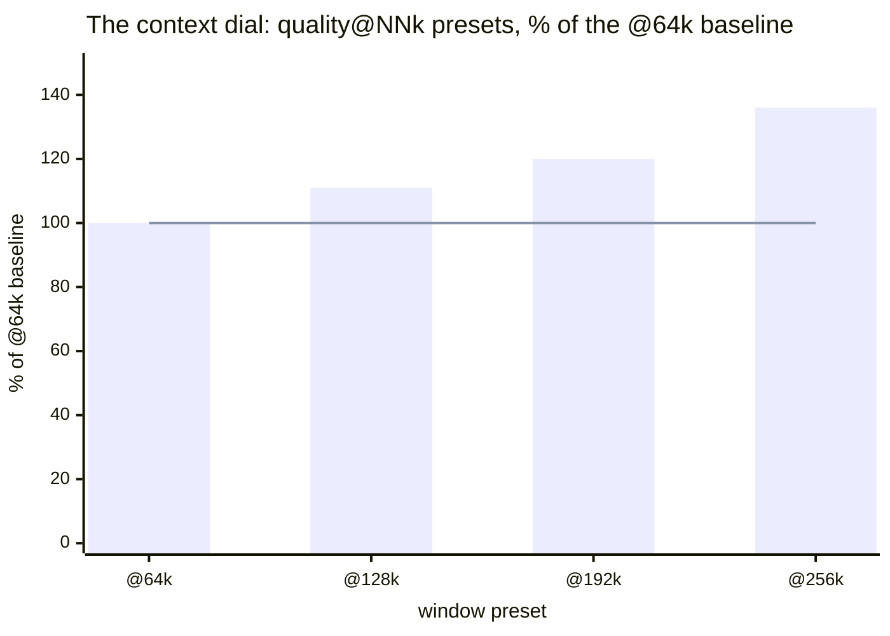
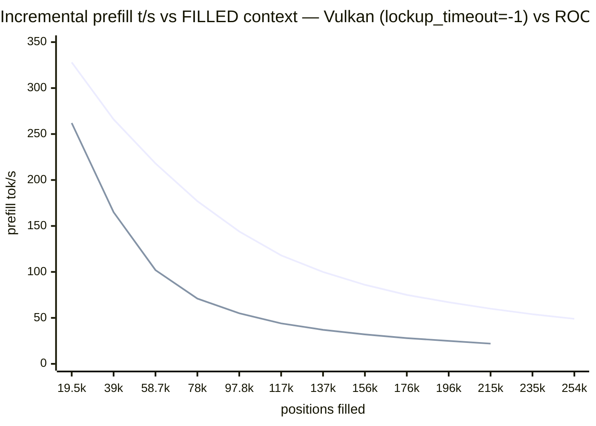

# Qwen3.8-27B on Strix Halo (Radeon 8060S / gfx1151)

> *Speed is useful, but quality is fundamental — one subtle bug fewer or a better
> codebase always pays for itself in wall-time gained.*

Run Qwen3.8-27B with the [strix-halo llama.cpp](https://github.com/Nathanw1014/strix-halo-llamacpp)
fork on a Ryzen AI MAX+ 395, with DFlash2 speculative decoding.
## Why this exists: cloud-free intelligence on a desk

If you are a solo developer with an AI agent working around the clock, a
privacy-sensitive operator, or any other entity that wants to be free from
cloud chains — read on. An all-purpose computer that cost **less than €2,000**
(launch offer) now serves a 27-billion-parameter reasoning model, entirely
from your own desk. Which machine? We tested on a **GMKtec EVO-X2** (Ryzen
AI MAX+ 395, 128 GiB) — [amazon.it/dp/B0F6X332N6](https://www.amazon.it/dp/B0F6X332N6/) —
any mini-PC or desktop with the same AMD Strix Halo APU works the same. **Not
affiliated**: no sponsorship, no free hardware, no affiliate links (the
shopping link above is a plain product URL, no referral tag); we paid for
ours. External links in this README point only to the open-source projects,
model publishers, hardware references, and community threads this work builds
on or measures — see
[Acknowledgements](#-thanks-to-the-authors-of-this-software-stack) — never to
sponsored placements.

- **No API keys, no quotas, no meters.** The model lives in your RAM
  (~122 GiB of it, mlock'd — the box's whole personality is inference).
- **Real speeds, measured**: 16–21 tokens/s typical sustained decode with
  DFlash2 speculative decoding (content-dependent: acceptance spans
  0.28–0.91, so the same model spans ~15–35 t/s; peaks near the top on
  narrative-style output), ~330 t/s prefill; a five-recipe menu (quality /
  balanced / speed / vision / a context dial to a 256k-token window) you
  switch per request, like a reasoning level.
- **Sips power**: ~85 W sustained at full tilt — order of magnitude under a
  multi-GPU rig; idle cost roughly a lightbulb (~€0.04/night at €0.12/kWh,
  computed from the 85 W figure — verify against your tariff).
- **Private by physics**: prompts never leave the machine. No telemetry to
  disable, no retention policy to trust — unplugged is unambiguous.
- **Yours**: no deprecations, no price changes, no terms-of-service updates
  that quietly reshape your workflow. The stack is open source end to end.

The recipes, the numbers, and every trap we hit (there were many) are
documented below — so your agent can run 24/7 on hardware you own outright.

**How we know (the method behind every number):** all benchmarks are
back-to-back interleaved pairs (lesson #1); every battery's raw evidence is
committed under `results/` — CSVs, server logs, kernel journal excerpts;
experiments run under pre-registered decision rules (`docs/PLAN-reasoning-economics.md`)
and the reasoning batteries' answer keys are computed by the graders
themselves; claims carry OBSERVED / INFERRED / REPORTED labels; and when our
own adversarial README audit caught numbers without committed evidence, we
corrected the README rather than the evidence (2026-08-23). If a number here
can't be re-run from this repo, it doesn't belong here.

## Provenance note

> *Humans architected, verified, sealed. AI assistants built and wrote all the
delivered stuff.*

The architecture decisions, every acceptance of a
measurement, and the seal of each release were human; the builds, probes,
batteries, tables, and most of this documentation were produced by AI
assistants under that supervision — including this sentence. Every number in
this README traces to a command you can re-run.
## TL;DR — reproduce on any gfx1151 (Strix Halo) box

Six steps, ~45 min, no desktop environment needed (Arch minimal headless verified
end-to-end on a second box, 2026-08-21; Ubuntu may work, untested):

```bash
# 0. this repo (launchers, recipes, systemd unit, model downloader)
git clone https://github.com/PieBru/Qwen-3.8-27B_Strix-Halo_gfx1151 && cd Qwen-3.8-27B_Strix-Halo_gfx1151
# 1. deps (Arch; versions OBSERVED working: shaderc 2026.3, libdrm 2.4.134)
sudo pacman -S --needed base-devel cmake ninja git shaderc vulkan-headers \
  spirv-headers vulkan-icd-loader vulkan-radeon vulkan-tools libdrm
# 2. build the fork INSIDE the repo (llama.cpp/ is gitignored; or skip the
#    build: prebuilt v0.6.6 tarball — same commit, see Quick Start)
git clone https://github.com/Nathanw1014/llama.cpp && cd llama.cpp && git checkout strix-halo-vulkan
cmake -B build-vk -DGGML_VULKAN=ON -DCMAKE_BUILD_TYPE=Release -DGGML_NATIVE=ON -DLLAMA_CURL=OFF
cmake --build build-vk --target llama-server llama-cli llama-bench -j && cd ..
# 3. models — everything (targets + DFlash2 draft + vision mmproj), verified:
./download_models.sh            # ~73 GiB total; or pick: q6 q8 q5 draft mmproj
# 4. verify backend + bare perf (expect: Vulkan0 AMD 8060S; quiet box, f16 KV:
#    Q6 pp512 ~346 / tg32 ~8.6; Q8 pp512 ~366 / tg32 ~7.3 — zram churn can halve tg)
./build-vk/bin/llama-cli --list-devices
./build-vk/bin/llama-bench -m MODEL-UD-Q6_K_XL.gguf -ngl 99 -fa on -t 16 -b 4096 -ub 4096 -p 512 -n 32 -d 0,8192 -r 2
# 5. serve a preset (balanced = Q6 daily driver, ~17-21 t/s on a quiet box)
./run_llama-server.sh --goal balanced
curl -s localhost:8081/completion -H 'Content-Type: application/json' \
     -d '{"prompt":"Explain briefly why the sky is blue at sunset.","n_predict":64}'
```

Numbers are for an 85 W sustained PPT box; expect ±10% run-to-run. On a
**default kernel**, deep Vulkan fills die at ~137k positions — but that wall
is the **amdgpu lockup watchdog**, not Vulkan (kernel forensics 2026-08-23:
every "device lost" was a ring timeout + reset on our own submission). With
`amdgpu.lockup_timeout=-1` on the cmdline, the same battery filled the
**entire 262k window** (254,356 positions, zero errors) — see
[Vulkan vs ROCm](#vulkan-vs-rocm-which-and-why),
[the deep-positions A/B](#deep-positions-the-amdgpu-watchdog-wall--and-how-to-remove-it),
and the [stability playbook](#stability-without-the-kernel-gpu-watchdog-lockup_timeout-1-playbook).
(ROCm/TheRock 7.15 needs no kernel change and survived 215,228 on the same
battery — the fallback when boot params are off-limits.)
Once verified, pick your workload recipe from the
[**Recommended configs (per goal)**](#recommended-configs-per-goal) table.
## Headline findings (the counterintuitive ones)

Seven results from this setup that invert what most LLM users expect — each
measured, each linked to its evidence:

1. **Context allocation is free; filling it is not.** Decode speed does not
   scale with the *allocated* window on this hybrid-SSM model — 28–30 t/s
   whether `c` is 32k or 256k (Q8: 24.7 vs 24.9). Most layers carry a
   constant-size recurrent state; only fill depth costs
   (~10 t/s by 78k filled → 5.5 at 254k on the Q8 probe; see the decay
   table below). Consequence: the
   `quality@64k…@256k` presets turn the window into a per-request dial that
   costs only RAM. Details in the
   [findings](#sweep-findings-at-a-glance) and the recipes-table notes.
2. **A lighter quant is *slower* here, not faster.** With speculative decode,
   Q4 (16.7 GiB of weights) decodes at 28 t/s vs Q5's 32 — quant noise
   collapses DFlash2 draft acceptance (0.647 → 0.41) and rejected drafts eat
   the bandwidth win whole. [Why Q4 was dropped](docs/BUILDING.md#ud-q4_k_xl-evaluated-and-dropped-2026-08-21--gguf-deleted-locally)
3. **Sampling penalties are poison for speculative decode.** A mild
   `repeat_penalty 1.05` costs **23–28% decode t/s** on every spec recipe —
   penalized logits stop agreeing with the draft (acceptance 0.647 → 0.450).
   Prefill is immune; use it per-request only. [Lesson #9](#lessons-learned)
4. **f16 KV is both faster *and* higher-fidelity here.** 128 GiB of unified
   memory inverts the usual trade: q8_0 KV measured slower than f16 (Q6 19.2
   vs 20.8 t/s) — so the quality choice is also the speed choice. And if you
   do need to shrink a window: retrieval survives KV quantization down to q4_0
   (40/40 needles, f16→q4_0, up to 96k). [Findings](#sweep-findings-at-a-glance)
5. **Two recipes = two full weight copies, even for the same GGUF file.**
   mmap shares the file pages, but each recipe's process uploads its own GTT
   weights copy — measured 41.0 → 71.5 GiB RAM when vision loaded next to
   balanced (same Q6 file). No flag or Linux trick dedups device memory
   across processes. (Concurrency note, [recipes](#recommended-configs-per-goal))
6. **Vision is free until the first image arrives.** Attaching mmproj costs
   ~nothing statically and text runs at full speed — but image tokens crash
   the DFlash2 speculative batch, so the vision recipe rides without spec
   decode (8.4 t/s vs 29 for the same weights). "It loads" ≠ "it works".
   [Lesson #7](#lessons-learned)
7. **Thinking is not the expensive part — running out of it is.** On
   olympiad-style items at a 4k completion budget, *thinking* modes failed
   30–40% by burning the whole budget on reasoning and returning **nothing**,
   while non-thinking solved 10/10. The effort knob doesn't order cost
   (median thinking tokens are flat low→xhigh); only `reasoning_budget_tokens`
   is a real cap. Full story:
   [Reasoning levels — measured](#reasoning-levels-cost-and-quality--measured).

Also big, but limitation-shaped rather than surprise-shaped: the 1M-context
story (262k servable ceiling, measured RAM budget, three routes to 1M) has
[its own chapter](#the-1m-token-context-what-works-what-doesnt-and-what-it-costs).
## Quick start: run the prebuilt release (time-saving)

Skip the build entirely — the toolbox releases ship a portable, self-contained stack
(latest `v0.6.6`, `strix-halo-llamacpp-vulkan-portable.tar.gz`) that bundles its own
RADV + libdrm, so it won't touch the system driver and needs no compile toolchain:

```bash
curl -L https://github.com/Nathanw1014/strix-halo-llamacpp/releases/download/v0.6.6/strix-halo-llamacpp-vulkan-portable.tar.gz | tar xz
# the tarball's launcher self-sets the perf env; run its server directly with the
# preset flags (the repo's run_llama-server.sh hardcodes the local build path):
#   ./vulkan/llama-server -m <UD-Q6_K_XL.gguf> -md <DFlash2-Q8_0.gguf> -ngl all -fa on \
#       -c 65536 -b 4096 -ub 4096 --spec-type draft-dflash --spec-draft-n-max 6 --host 0.0.0.0
```

Verified on this box: the tarball pins commit `7b6c613`; the fork tip is
perf-identical within 1% (chat-parser-only delta since). Read on only if you want
to build from source.
## What's in this repo

Model weights (`.gguf`) and the `llama.cpp/` clone are local-only; this repo holds
the serving setup and notes:

- `run_llama-server.sh` — **unified launcher**: `--goal quality|balanced|speed`
  single-model presets, or `--router` to serve every recipe; every field overridable
  (`--model`, `--ctx`, `--nmax`, `--kv`, `--port`, `--draft`, `--no-mlock`, `--dry-run`;
  agent surface opt-in: `--agent`, `--tools`, `--mcp-config`, `--tools-runtime`;
  `--help` explains each)
- `models.ini` — the router recipes (the names in the table below)
- `llama-router.service` — systemd user unit (installs to `~/.config/systemd/user/`)
- `sharp.jinja` — fixed chat template for this model family (see Thanks)
- `download_models.sh` — **fetch the target GGUFs**: parallel-range downloads
  (~8× faster), sha256-verified against the table below, atomic install,
  tip-drift warning; `--check` re-verifies files already on disk
- `update_strix-halo-llamacpp_vulkan.sh` — pull/rebuild the fork + backend check
- `sweep_llama_configs.sh` — staged config search ([config research](#config-research-sweep_llama_configssh))

**The detail pages** (each opens from the front page where it's summarized):

- [docs/RUNNING.md](docs/RUNNING.md) — operations: router, alias, pi pairing,
  margin rule, recipe deep-dive, verification
- [docs/DEEP-CONTEXT.md](docs/DEEP-CONTEXT.md) — the 256k/1M window, the
  watchdog wall, unattended stability
- [docs/BACKENDS.md](docs/BACKENDS.md) — Vulkan vs ROCm A/B, halofpx, HIP build
- [docs/REASONING.md](docs/REASONING.md) — reasoning cost/quality batteries
- [docs/BENCHMARKS.md](docs/BENCHMARKS.md) — sweep findings, threads study,
  config research
- [docs/BUILDING.md](docs/BUILDING.md) — models, quants, deps, builds
## Recommended configs (per goal)

| Goal | Router recipe (`models.ini`) | Command (`run_llama-server.sh …`) | context | RAM (GiB) | left (GiB) | tg (t/s) | pp4k (t/s) | PPL / KLD↑ |
|---|---|---|---|---:|---:|---:|---:|---:|
| **Quality @256k** | `Qwen38-27B-quality@256k` | router-only (Q8 @ 256k) | 262144 (servable ceiling) | ~61 | ~63 | ~25 | ~330 | 4.692 / ref |
| **Quality** | `Qwen38-27B-quality@64k` (+`@96k`, `@128k`, `@192k`) | `--goal quality` (Q8) | 65536 window; presets to 256k | ~45 | ~78 | ~25 | ~330 | 4.692 / ref |
| **Balanced** | `Qwen38-27B-balanced` (+`@96k` fence variant) | `run_llama-server.sh` (Q6) | 131072 window (agentic-sized); flat to 256k | ~42 | ~80 | **~17–21** | ~306 | 4.706 / 0.0073 |
| **Coding** | `Qwen38-27B-coding` (alias `coding`) | router-only (Q6, 128k, reasoning-budget 2048) | 131072 | ~42 | ~80 | ~17–21 | ~306 | 4.706 / 0.0073 |
| **Speed** | `Qwen38-27B-speed` | `--goal speed` (Q5, n-max 5) | 65536 | ~35 | ~88 | **~23** | ~297 | 4.722 / 0.0137 |
| **Vision** | `Qwen38-27B-vision` | router-only (mmproj, no spec) | 65536 | ~32 | ~91 | ~8.4 | — | 4.706 / 0.0073 |

**Coding = balanced + a measured guard.** Same Q6 weights, window and
speed as balanced; the only difference is a server-side
`reasoning-budget 2048` default — insurance against the one failure mode
the reasoning batteries actually found: thinking that eats a bounded
`max_tokens` whole and returns an *empty* answer (60–70% of frontier items
at a 4k budget). 2048 sits above hard-routine thinking p90 (~610–736), so
normal work never touches it. Override per request: body
`reasoning_budget_tokens` — `32768` for effectively-unrestricted deep work,
`0` to end thinking immediately, absent/`-1` inherits 2048. Rationale and
verifications: models.ini `[Qwen38-27B-coding]` section comment and the
[reasoning chapter](#reasoning-levels-cost-and-quality--measured).

**The context dial.** All `quality@NNk` presets are the same weights, quality
and decode speed — allocation is free (headline #1), so `NN` buys only the
window and its RAM price (~45 → ~61 GiB from @64k to @256k). Switch presets
per **request**, even mid-session: standard clients resend the full history
every call, so the new preset's first request rebuilds ("renews") the context
after one ~6–15 s on-demand load — verified with a needle set on @64k and
recalled on @192k. For fully-local users this makes the context window a
dial much like the reasoning-level switch (none/low/medium/high), trading
free RAM for window on the fly; `--models-max 1` serializes the switch (the
old preset unloads first — switch between requests, not during one).



Bars = RAM occupied; line = decode speed (quality is likewise flat) — the window
costs memory and nothing else. (Fill-depth decay, above, is the separate price
of actually *using* the window.)

## Running it

Operations — serving all recipes via the router, the movable `Qwen38-27B`
default alias, pairing with the [pi coding agent](docs/RUNNING.md#pair-it-with-pi-the-coding-agent),
the 24/7 agent margin rule, one operator's profile, and GPU verification:
**[docs/RUNNING.md](docs/RUNNING.md)** (the recipe deep-dive — fill-decay
table, when-to-pick notes, relative costs — lives there too).

## Test — verify GPU, not silent CPU fallback

[`llama-cli --list-devices` and the quiet-box reference bench](docs/RUNNING.md#test--verify-gpu-not-silent-cpu-fallback).

## Sweep findings at a glance

The full config-research table — KV types, n-max, batch sizes, host state,
n-gram replay findings: **[docs/BENCHMARKS.md](docs/BENCHMARKS.md#sweep-findings-at-a-glance)**.

## Threads (`-t`), batch threads (`-tb`) and two concurrent clients — measured

`-t 1 -tb 1` is free under full GPU offload; `-t 2 -tb 1` is the one bad
shape; two clients nearly double aggregate decode:
**[docs/BENCHMARKS.md](docs/BENCHMARKS.md#threads--t-batch-threads--tb-and-two-concurrent-clients--measured)**.

## The 1M-token context: what works, what doesn't, and what it costs

The 262k servable ceiling, the YaRN cap, what 1M costs in memory, and the
three routes to a real 1M window: **[docs/DEEP-CONTEXT.md](docs/DEEP-CONTEXT.md)**.

### Deep positions: the amdgpu watchdog wall — and how to remove it

The 136,965 "Vulkan wall" was the kernel lockup watchdog — forensics and the
`lockup_timeout=-1` intervention (full window, 254,356, verified):
**[docs/DEEP-CONTEXT.md](docs/DEEP-CONTEXT.md#deep-positions-the-amdgpu-watchdog-wall--and-how-to-remove-it)**.

## Vulkan vs ROCm, which and why?

The measured A/B, speed/stability pictures, and the practical ranking — in
one chart, incremental prefill while the context fills, our two GPU
backends head-to-head:



Vulkan leads at every depth (2.7× by 117k) and, with the amdgpu watchdog
out of the way, fills the **entire 262k window** — the old "Vulkan dies at
137k" was the kernel killing slow-but-legal dispatches, not a driver bug
(forensics + intervention in the page below). The full story — bare-bench
parity, DFlash2-on-ROCm, the halofpx comparison, the HIP build recipe:
**[docs/BACKENDS.md](docs/BACKENDS.md)**.

### How this compares with halofpx as of 2026-08-22

The measured-quality-first comparison with the speed-first cousin:
**[docs/BACKENDS.md](docs/BACKENDS.md#how-this-compares-with-halofpx-as-of-2026-08-22)**.

## Stability without the kernel GPU watchdog (lockup_timeout=-1 playbook)

Three-layer unattended stability — hardware TCO, the GPU canary, the scoped
reboot grant: **[docs/DEEP-CONTEXT.md](docs/DEEP-CONTEXT.md#stability-without-the-kernel-gpu-watchdog-lockup_timeout-1-playbook)**.

## Reasoning levels: cost and quality — measured

Levels are style, not cost; only `reasoning_budget_tokens` is a real cap;
thinking inside a bounded budget can starve the answer — and what we run
because of it: **[docs/REASONING.md](docs/REASONING.md)**.

## Models — Unsloth Dynamic GGUFs, aligned with the repo tip

Which GGUFs we run and why, the v3.0 tie-battery, the Q4 drop:
**[docs/BUILDING.md](docs/BUILDING.md#models--unsloth-dynamic-ggufs-aligned-with-the-repo-tip)**.

## Environment · Dependencies · Build from source · The toolbox

Environment notes, the OBSERVED dependency set, building the fork, the
prebuilt toolbox: **[docs/BUILDING.md](docs/BUILDING.md#environment)**.

## Optional: HIP variant (ROCm build)

The no-root TheRock build recipe: **[docs/BACKENDS.md](docs/BACKENDS.md#optional-hip-variant-rocm-build)**.

## Config research (`sweep_llama_configs.sh`)

The staged sweep harness and how every table number was produced:
**[docs/BENCHMARKS.md](docs/BENCHMARKS.md#config-research-sweep_llama_configssh)**.
## Lessons learned

1. **Measure back-to-back or not at all.** Absolute t/s drifts with box state; only
   interleaved pairs give trustworthy rankings. Mind **run order** too: the first
   server after a cold start pays page-cache warm-up, so sequential ladders lean
   toward whatever ran last. Reversed-order passes are how you catch both biases.
2. **zram eats inference.** GTT weight pages are shmem-backed → swappable → they
   compress into zram under load churn, and decode then pays per-token
   decompression (up to ~30%). Fixes, best first: (a) `-lm mmap+mlock` so the
   weights can never be swapped (needs `memlock` unlimited — see next);
   (b) tune the pressure that triggers swapping instead of disabling it:
   `vm.swappiness` (default 60 biases toward swapping anon pages; 1–10 makes zram
   a last resort) and `vm.watermark_scale_factor` (how early kswapd wakes);
   (c) `sudo swapoff -a` disables zram entirely until reboot — safe on 128 GB with
   the box otherwise quiet, but it removes the safety net and makes the kernel's
   precautional OOM killer trigger earlier under pressure. We prefer (a)+(b).

   The exact (b) we run on both boxes — `/etc/sysctl.d/99-llama-inference.conf`:
   `vm.swappiness = 10` (zram a last resort) and `vm.watermark_scale_factor = 125`
   (wake kswapd earlier — the install-time value of 10 gives a ~13 MiB wake gap
   on 124 GiB, i.e. almost never, which caused late direct-reclaim stalls; 125
   gives ~158 MiB of background-reclaim headroom). Apply with
   `sudo sysctl --system`; flush a filled zram without rebooting with
   `sudo swapoff /dev/zram0 && sudo systemctl restart
   systemd-zram-setup@zram0.service` (checked RAM headroom first). Monitor with
   `swapon --show` and `/sys/block/zram0/mm_stat` — the first column should stay
   near 0 during normal serving; anything growing means something swapped and
   decode is paying for it.
3. **mlock needs a limit raise — and fails SILENTLY without it.** Default
   `ulimit -l` here was 8192 KB (8 MB-class) and multi-GB buffers then fail with
   `Cannot allocate memory`. One-time, then re-login:
   `echo -e 'piero soft memlock unlimited\npiero hard memlock unlimited' | sudo tee /etc/security/limits.d/99-llama-mlock.conf`
   ⚠️ The server only *warns* on mlock ENOMEM and keeps serving **unprotected** —
   it does not abort. After re-login verify: `ulimit -l` must print `unlimited`.
4. **Power is a throttling detector, not a cost metric.** We log PPT only to
   confirm the box holds a flat 85 W (no throttle). A Strix Halo's max draw is more
   than an order of magnitude below a pre-Blackwell NVIDIA desktop part — the
   interesting wattage story is elsewhere.
5. **A clean box is part of the benchmark.** You don't need to dedicate the machine
   to inference — but if you want SOTA-at-home, privilege inference quality over
   co-located niceties (a SQL server, several heavy LLMs on the same box). One
   model, mlocked, on quiet unified memory.
6. **Trust but verify the fork's failure modes.** The `vk::DeviceLostError` ceiling
   (deep prefill ≥128k) and the one-off KV core dump were found by sweeping —
   neither appears in casual use. Allocation ≠ prefill: 256k ctx loads in 20 s.
   (The ceiling later root-caused to the amdgpu lockup watchdog — kernel
   forensics + `lockup_timeout=-1` intervention; see the Vulkan-vs-ROCm
   chapter. The lesson stands: sweep, don't trust.)
7. **Vision is cheap — until an image actually arrives.** Attaching `mmproj-F16`
   to a spec recipe costs almost nothing statically (+~1.2 GB GTT, +~0.6 s load;
   text decode neutral) and the recipe serves text at full speed — but the first
   real image request dies with `decode() failed: failed to process speculative
   batch`: image embeddings are incompatible with the DFlash2 spec path in this
   fork. Hence vision is its own `Qwen38-27B-vision` recipe with `spec-type = none` —
   it pays the no-spec decode tax (8.4 t/s vs 21–29 for the same weights with
   spec; image encode itself is fast, <0.5 s warm for 512 px) so every text recipe
   keeps its speed, and it's the lightest resident recipe (~32 GiB, no draft
   model). **"It loads" ≠ "it works"** — a vision setup that was never probed with
   a real image is unverified. (`--mmproj` is a per-section ini key by design; the
   router strips it from the shared CLI.)
8. **Router CLI args silently override per-recipe ini keys.** The router overlays
   its own command line onto every `models.ini` section: a key present in both is
   always won by the CLI and the section key is dead — no warning is logged. The
   per-child `n_max=` journal line is the ground truth. Rule: shared flags ride the
   router CLI, divergent keys (`spec-type`, `spec-draft-n-max`, `model-draft`,
   `mmproj`) live *only* in the sections.
9. **Sampling penalties are poison for speculative decode.** `repeat_penalty 1.05`
   collapses DFlash2 draft acceptance from 0.647 to 0.450 (mean accepted run
   4.8 → 3.4 tokens) — the penalized logits stop agreeing with the draft's
   continuations, so most drafted tokens get rejected and decode reverts toward
   no-spec speed. Measured cost (same loaded model, temp 0): Q6 29.0 → 21.0 (−28%),
   Q5-turbo ~23 → ~17 (−25%), Q8 ~17 → ~13 (−23%). Prefill is immune (no
   sampling) and no-spec recipes (vision) are unaffected. Per-request only, when
   repetition actually bites.
10. **Re-sending an identical prompt after a long-prompt task serves garbage
    (slot-KV contamination).** Repro (any quant, single-slot router): send prompt
    A (short) → send prompt B (~5k tokens) → send A again. The third request's
    prefix-match trusts a KV that no longer holds A, evaluates only ~3–4 of A's
    12 tokens, and decodes from a corrupted context: one quant degenerates to
    garbage (acceptance 0.02), another echoes prior content deterministically
    (acceptance 0.95 — fast *and* wrong). A different prompt recovers immediately.
    **Workaround (verified): per-request `"cache_prompt": false` on re-sent
    identical prompts.** Benchmarking corollary: only fresh-slot (first task after
    load) numbers are honest.
## 🙏 Thanks to the authors of this software stack

This experiment stands entirely on other people's work:

- **[Nathanw1014](https://github.com/Nathanw1014)** — the
  [strix-halo llama.cpp toolbox](https://github.com/Nathanw1014/strix-halo-llamacpp)
  and fork branches: the FA dequant-once / transpose prefill fixes, the mmid MoE
  work, the evidence-driven benchmark methodology, and the prebuilt payloads this
  repo leans on. Also the author of the r/LocalLLaMA benchmarks this README
  reality-checks against.
- **[aic0d3r](https://github.com/aic0d3r)** — the independent port/validation of the
  prefill stack onto current main
  ([ROCmFPX#86](https://github.com/charlie12345/ROCmFPX/issues/86)), which confirmed
  the fixes and documented the silent-CPU-fallback trap.
- **Gaetan Puleo** — the DeepSeek V4 lightning-indexer Vulkan kernels contributed to
  the fork.
- **The r/LocalLLaMA community behind the
  [“Qwen3.8-27B Q5_K_XL on Strix Halo at 31 t/s decode” thread](https://www.reddit.com/r/LocalLLaMA/comments/1vsw6nz/qwen3827b_q5_k_xl_on_strix_halo_at_31_ts_decode/)**
  — the post that inspired these tests, and specifically
  [the comment](https://www.reddit.com/r/LocalLLaMA/comments/1vsw6nz/comment/p4tku1z/?context=3)
  whose config (Q8 target, DFlash2 draft 4, u/ub 2048) seeded our sweep starting point.
- **[llama.cpp](https://github.com/ggml-org/llama.cpp) / ggml** — the whole enterprise:
  the upstream project and its maintainer team and community.
- **[Mesa / RADV](https://www.mesa3d.org/) and the [AMD ROCm](https://rocm.docs.amd.com/)
  teams** — the open Vulkan and compute stacks that make gfx1151 a first-class
  citizen, and the driver-level compute work this fork's kernels assume.
- **[Unsloth](https://unsloth.ai/)** — the UD (Unsloth Dynamic 1.2 2-quant v2)
  Q5–Q8_K_XL quantizations used as targets across these experiments
  ([repo](https://huggingface.co/unsloth/Qwen3.8-27B-GGUF)),
  and the community's quant tooling.
- **The Qwen team (Alibaba)** — the Qwen 3.8 model family these configs run.
- **[u/froggeric](https://www.reddit.com/user/froggeric)** — author of
  [*Fixed jinja chat template for Qwen 3.5/3.6 and the Qwen3.8 family*
  (r/LocalLLaMA)](https://www.reddit.com/r/LocalLLaMA/comments/1vnm7le/fixed_jinja_chat_template_for_qwen_35_36_and_the/).
  The `sharp.jinja` template shipped here is that work
  (`qwen3.8-froggeric-v22.1.1`) — it fixed the broken tool-call/thinking formatting
  that stock templates produce for this model family. Without it the server output
  would be garbage with tools enabled.
## License

[MIT](LICENSE) © 2026 PieBru. The configs and notes here are MIT; the
[strix-halo llama.cpp fork](https://github.com/Nathanw1014/llama.cpp) and llama.cpp
itself remain under their own MIT license, and the model weights (not in this repo)
belong to their respective publishers.
