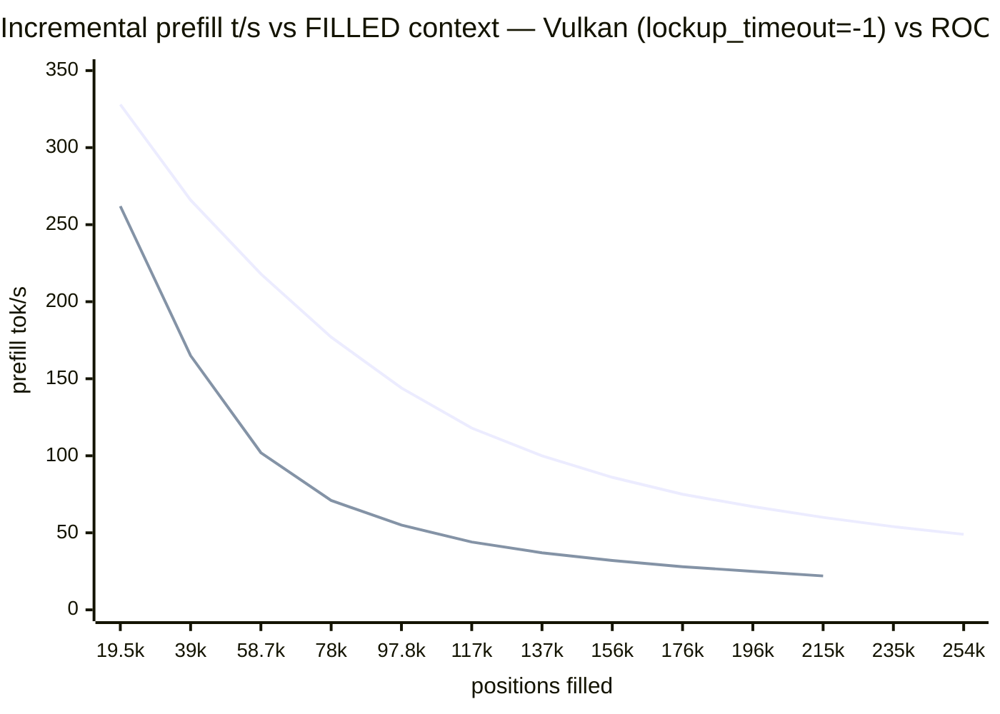

# Qwen3.8-27B on Strix Halo (Radeon 8060S / gfx1151)

> *Speed is useful, but quality is fundamental — one subtle bug fewer or a better
> codebase always pays for itself in wall-time gained.*

Run Qwen3.8-27B with the [strix-halo llama.cpp](https://github.com/Nathanw1014/strix-halo-llamacpp)
fork on a Ryzen AI MAX+ 395, with DFlash2 speculative decoding.
## Why this exists: cloud-free intelligence on a desk

If you are a solo developer with an AI agent working around the clock, a
privacy-sensitive operator, or any other entity that wants to be free from
cloud chains — read on. An all-purpose computer that cost **less than €2,000**
(launch offer) now serves a 27-billion-parameter reasoning model, entirely
from your own desk. Which machine? We tested on a **GMKtec EVO-X2** (Ryzen
AI MAX+ 395, 128 GiB) — [amazon.it/dp/B0F6X332N6](https://www.amazon.it/dp/B0F6X332N6/) —
any mini-PC or desktop with the same AMD Strix Halo APU works the same. **Not
affiliated**: no sponsorship, no free hardware, no affiliate links (the
shopping link above is a plain product URL, no referral tag); we paid for
ours. External links in this README point only to the open-source projects,
model publishers, hardware references, and community threads this work builds
on or measures — see
[Acknowledgements](#-thanks-to-the-authors-of-this-software-stack) — never to
sponsored placements.

- **No API keys, no quotas, no meters.** The model lives in your RAM
  (~122 GiB of it, mlock'd — the box's whole personality is inference).
- **Real speeds, measured**: 16–21 tokens/s typical sustained decode with
  DFlash2 speculative decoding (content-dependent: acceptance spans
  0.28–0.91, so the same model spans ~15–35 t/s; peaks near the top on
  narrative-style output), ~330 t/s prefill; a five-recipe menu (quality /
  balanced / speed / vision / a context dial to a 256k-token window) you
  switch per request, like a reasoning level.
- **Sips power**: ~85 W sustained at full tilt — order of magnitude under a
  multi-GPU rig; idle cost roughly a lightbulb (~€0.04/night at €0.12/kWh,
  computed from the 85 W figure — verify against your tariff).
- **Private by physics**: prompts never leave the machine. No telemetry to
  disable, no retention policy to trust — unplugged is unambiguous.
- **Yours**: no deprecations, no price changes, no terms-of-service updates
  that quietly reshape your workflow. The stack is open source end to end.

The recipes, the numbers, and every trap we hit (there were many) are
documented below — so your agent can run 24/7 on hardware you own outright.

**How we know (the method behind every number):** all benchmarks are
back-to-back interleaved pairs (lesson #1); every battery's raw evidence is
committed under `results/` — CSVs, server logs, kernel journal excerpts;
experiments run under pre-registered decision rules (`docs/PLAN-reasoning-economics.md`)
and the reasoning batteries' answer keys are computed by the graders
themselves; claims carry OBSERVED / INFERRED / REPORTED labels; and when our
own adversarial README audit caught numbers without committed evidence, we
corrected the README rather than the evidence (2026-08-23). If a number here
can't be re-run from this repo, it doesn't belong here.

## Provenance note

> *Humans architected, verified, sealed. AI assistants built and wrote all the
delivered stuff.*

The architecture decisions, every acceptance of a
measurement, and the seal of each release were human; the builds, probes,
batteries, tables, and most of this documentation were produced by AI
assistants under that supervision — including this sentence. Every number in
this README traces to a command you can re-run.
## TL;DR — reproduce on any gfx1151 (Strix Halo) box

Six steps, ~45 min, no desktop environment needed (Arch minimal headless verified
end-to-end on a second box, 2026-08-21; Ubuntu may work, untested):

```bash
# 0. this repo (launchers, recipes, systemd unit, model downloader)
git clone https://github.com/PieBru/Qwen-3.8-27B_Strix-Halo_gfx1151 && cd Qwen-3.8-27B_Strix-Halo_gfx1151
# 1. deps (Arch; versions OBSERVED working: shaderc 2026.3, libdrm 2.4.134)
sudo pacman -S --needed base-devel cmake ninja git shaderc vulkan-headers \
  spirv-headers vulkan-icd-loader vulkan-radeon vulkan-tools libdrm
# 2. build the fork INSIDE the repo (llama.cpp/ is gitignored; or skip the
#    build: prebuilt v0.6.6 tarball — same commit, see Quick Start)
git clone https://github.com/Nathanw1014/llama.cpp && cd llama.cpp && git checkout strix-halo-vulkan
cmake -B build-vk -DGGML_VULKAN=ON -DCMAKE_BUILD_TYPE=Release -DGGML_NATIVE=ON -DLLAMA_CURL=OFF
cmake --build build-vk --target llama-server llama-cli llama-bench -j && cd ..
# 3. models — everything (targets + DFlash2 draft + vision mmproj), verified:
./download_models.sh            # ~73 GiB total; or pick: q6 q8 q5 draft mmproj
# 4. verify backend + bare perf (expect: Vulkan0 AMD 8060S; quiet box, f16 KV:
#    Q6 pp512 ~346 / tg32 ~8.6; Q8 pp512 ~366 / tg32 ~7.3 — zram churn can halve tg)
./build-vk/bin/llama-cli --list-devices
./build-vk/bin/llama-bench -m MODEL-UD-Q6_K_XL.gguf -ngl 99 -fa on -t 16 -b 4096 -ub 4096 -p 512 -n 32 -d 0,8192 -r 2
# 5. serve a preset (balanced = Q6 daily driver, ~17-21 t/s on a quiet box)
./run_llama-server.sh --goal balanced
curl -s localhost:8081/completion -H 'Content-Type: application/json' \
     -d '{"prompt":"Explain briefly why the sky is blue at sunset.","n_predict":64}'
```

Numbers are for an 85 W sustained PPT box; expect ±10% run-to-run. On a
**default kernel**, deep Vulkan fills die at ~137k positions — but that wall
is the **amdgpu lockup watchdog**, not Vulkan (kernel forensics 2026-08-23:
every "device lost" was a ring timeout + reset on our own submission). With
`amdgpu.lockup_timeout=-1` on the cmdline, the same battery filled the
**entire 262k window** (254,356 positions, zero errors) — see
[Vulkan vs ROCm](#vulkan-vs-rocm-which-and-why),
[the deep-positions A/B](#deep-positions-the-amdgpu-watchdog-wall--and-how-to-remove-it),
and the [stability playbook](#stability-without-the-kernel-gpu-watchdog-lockup_timeout-1-playbook).
(ROCm/TheRock 7.15 needs no kernel change and survived 215,228 on the same
battery — the fallback when boot params are off-limits.)
Once verified, pick your workload recipe from the
[**recipe menu**](docs/RECIPES.md) table.
## Headline findings (the counterintuitive ones)

Seven results from this setup that invert what most LLM users expect — each
measured, each linked to its evidence:

1. **Context allocation is free; filling it is not.** Decode speed does not
   scale with the *allocated* window on this hybrid-SSM model — 28–30 t/s
   whether `c` is 32k or 256k (Q8: 24.7 vs 24.9). Most layers carry a
   constant-size recurrent state; only fill depth costs
   (~10 t/s by 78k filled → 5.5 at 254k on the Q8 probe; see the decay
   table below). Consequence: the
   `quality@64k…@256k` presets turn the window into a per-request dial that
   costs only RAM. Details in the
   [findings](#sweep-findings-at-a-glance) and the recipes-table notes.
2. **A lighter quant is *slower* here, not faster.** With speculative decode,
   Q4 (16.7 GiB of weights) decodes at 28 t/s vs Q5's 32 — quant noise
   collapses DFlash2 draft acceptance (0.647 → 0.41) and rejected drafts eat
   the bandwidth win whole. [Why Q4 was dropped](docs/BUILDING.md#ud-q4_k_xl-evaluated-and-dropped-2026-08-21--gguf-deleted-locally)
3. **Sampling penalties are poison for speculative decode.** A mild
   `repeat_penalty 1.05` costs **23–28% decode t/s** on every spec recipe —
   penalized logits stop agreeing with the draft (acceptance 0.647 → 0.450).
   Prefill is immune; use it per-request only. [Lesson #9](docs/LESSONS.md)
4. **f16 KV is both faster *and* higher-fidelity here.** 128 GiB of unified
   memory inverts the usual trade: q8_0 KV measured slower than f16 (Q6 19.2
   vs 20.8 t/s) — so the quality choice is also the speed choice. And if you
   do need to shrink a window: retrieval survives KV quantization down to q4_0
   (40/40 needles, f16→q4_0, up to 96k). [Findings](#sweep-findings-at-a-glance)
5. **Two recipes = two full weight copies, even for the same GGUF file.**
   mmap shares the file pages, but each recipe's process uploads its own GTT
   weights copy — measured 41.0 → 71.5 GiB RAM when vision loaded next to
   balanced (same Q6 file). No flag or Linux trick dedups device memory
   across processes. (Concurrency note, [recipes](docs/RECIPES.md))
6. **Vision is free until the first image arrives.** Attaching mmproj costs
   ~nothing statically and text runs at full speed — but image tokens crash
   the DFlash2 speculative batch, so the vision recipe rides without spec
   decode (8.4 t/s vs 29 for the same weights). "It loads" ≠ "it works".
   [Lesson #7](docs/LESSONS.md)
7. **Thinking is not the expensive part — running out of it is.** On
   olympiad-style items at a 4k completion budget, *thinking* modes failed
   30–40% by burning the whole budget on reasoning and returning **nothing**,
   while non-thinking solved 10/10. The effort knob doesn't order cost
   (median thinking tokens are flat low→xhigh); only `reasoning_budget_tokens`
   is a real cap. Full story:
   [Reasoning levels — measured](#reasoning-levels-cost-and-quality--measured).

Also big, but limitation-shaped rather than surprise-shaped: the 1M-context
story (262k servable ceiling, measured RAM budget, three routes to 1M) has
[its own chapter](#the-1m-token-context-what-works-what-doesnt-and-what-it-costs).
## Quick start: run the prebuilt release (time-saving)

No build, no toolchain: the toolbox tarball bundles its own RADV + libdrm
and is verified perf-identical to the fork tip —
**[docs/QUICKSTART.md](docs/QUICKSTART.md)**, or build from source in the
[TL;DR](#tldr--reproduce-on-any-gfx1151-strix-halo-box).

## Recommended configs (per goal)

Five roles, one menu: **quality** (Q8, correctness-first) · **balanced**
(Q6 @ 128k, the daily driver, ~17–21 t/s) · **coding** (balanced + a
measured reasoning-budget guard) · **speed** (Q5, fastest decode) ·
**vision** (images, no spec decode by design) — plus the **context dial**
(`quality@NNk`, the window per request, allocation is free). The full
table with RAM/throughput/quality columns, when-to-pick notes, and the
dial explained: **[docs/RECIPES.md](docs/RECIPES.md)**.

## Running it

Operations — serving all recipes via the router, the movable `Qwen38-27B`
default alias, pairing with the [pi coding agent](docs/RUNNING.md#pair-it-with-pi-the-coding-agent),
the 24/7 agent margin rule, one operator's profile, and GPU verification:
**[docs/RUNNING.md](docs/RUNNING.md)** (the recipe deep-dive — fill-decay
table, when-to-pick notes, relative costs — lives there too).

## Test — verify GPU, not silent CPU fallback

[`llama-cli --list-devices` and the quiet-box reference bench](docs/RUNNING.md#test--verify-gpu-not-silent-cpu-fallback).

## Sweep findings at a glance

The full config-research table — KV types, n-max, batch sizes, host state,
n-gram replay findings: **[docs/BENCHMARKS.md](docs/BENCHMARKS.md#sweep-findings-at-a-glance)**.

## Threads (`-t`), batch threads (`-tb`) and two concurrent clients — measured

`-t 1 -tb 1` is free under full GPU offload; `-t 2 -tb 1` is the one bad
shape; two clients nearly double aggregate decode:
**[docs/BENCHMARKS.md](docs/BENCHMARKS.md#threads--t-batch-threads--tb-and-two-concurrent-clients--measured)**.

## The 1M-token context: what works, what doesn't, and what it costs

The 262k servable ceiling, the YaRN cap, what 1M costs in memory, and the
three routes to a real 1M window: **[docs/DEEP-CONTEXT.md](docs/DEEP-CONTEXT.md)**.

### Deep positions: the amdgpu watchdog wall — and how to remove it

The 136,965 "Vulkan wall" was the kernel lockup watchdog — forensics and the
`lockup_timeout=-1` intervention (full window, 254,356, verified):
**[docs/DEEP-CONTEXT.md](docs/DEEP-CONTEXT.md#deep-positions-the-amdgpu-watchdog-wall--and-how-to-remove-it)**.

## Vulkan vs ROCm, which and why?

The measured A/B, speed/stability pictures, and the practical ranking — in
one chart, incremental prefill while the context fills, our two GPU
backends head-to-head:



Vulkan leads at every depth (2.7× by 117k) and, with the amdgpu watchdog
out of the way, fills the **entire 262k window** — the old "Vulkan dies at
137k" was the kernel killing slow-but-legal dispatches, not a driver bug
(forensics + intervention in the page below). The full story — bare-bench
parity, DFlash2-on-ROCm, the halofpx comparison, the HIP build recipe:
**[docs/BACKENDS.md](docs/BACKENDS.md)**.

### How this compares with halofpx as of 2026-08-22

The measured-quality-first comparison with the speed-first cousin:
**[docs/BACKENDS.md](docs/BACKENDS.md#how-this-compares-with-halofpx-as-of-2026-08-22)**.

## Stability without the kernel GPU watchdog (lockup_timeout=-1 playbook)

Three-layer unattended stability — hardware TCO, the GPU canary, the scoped
reboot grant: **[docs/DEEP-CONTEXT.md](docs/DEEP-CONTEXT.md#stability-without-the-kernel-gpu-watchdog-lockup_timeout-1-playbook)**.

## Reasoning levels: cost and quality — measured

Levels are style, not cost; only `reasoning_budget_tokens` is a real cap;
thinking inside a bounded budget can starve the answer — and what we run
because of it: **[docs/REASONING.md](docs/REASONING.md)**.

## Models — Unsloth Dynamic GGUFs, aligned with the repo tip

Which GGUFs we run and why, the v3.0 tie-battery, the Q4 drop:
**[docs/BUILDING.md](docs/BUILDING.md#models--unsloth-dynamic-ggufs-aligned-with-the-repo-tip)**.

## Environment · Dependencies · Build from source · The toolbox

Environment notes, the OBSERVED dependency set, building the fork, the
prebuilt toolbox: **[docs/BUILDING.md](docs/BUILDING.md#environment)**.

## Optional: HIP variant (ROCm build)

The no-root TheRock build recipe: **[docs/BACKENDS.md](docs/BACKENDS.md#optional-hip-variant-rocm-build)**.

## Config research (`sweep_llama_configs.sh`)

The staged sweep harness and how every table number was produced:
**[docs/BENCHMARKS.md](docs/BENCHMARKS.md#config-research-sweep_llama_configssh)**.
## Lessons learned

Ten hard-won rules — measure back-to-back, zram eats inference, mlock fails
silently, penalties poison speculative decode, the KV-contamination trap,
and the "it loads ≠ it works" vision lesson:
**[docs/LESSONS.md](docs/LESSONS.md)**.

<a id="ideas-parked-help-wanted"></a>

## Ideas, parked

Things we researched, started, or parked — each is a standing invitation for a
fellow Haloer to pick up. The fleet has its own documentation set: **[docs/MULTI-HALO.md](docs/MULTI-HALO.md)**
(the guide: [HA stack as built](docs/FLEET-HA.md) — one VIP address,
failover-drilled, dashboard — plus [clustering research](docs/FLEET-CLUSTER.md)
and the [master plan](docs/FLEET-PLAN.md) with phases, bake-offs, and
decision rules); this chapter is the menu.

**Two-Halo fleet** (two 128 GB Strix boxes, one flock):

- **USB4 direct link** — a 0.8 m certified cable turns two Halos into a
  ~10–20 Gbps pair (vs 1 GbE); thunderbolt-net staging is ready on both
  boxes (`tb0`, static /30, module persisted). *Status: cable in transit —
  bring-up runbook ready.*
- **llama.cpp RPC virtual-Halo** — `ggml-rpc-server` + `--rpc` splits
  weights/KV across both boxes; the decoder needs only ~300 KB/s cross-
  traffic (1 GbE suffices!), prefill pays ~10–15%. Open upstream bugs to
  dodge: #26685 (Vulkan garble), #26746 (gfx1151 TOP_K crash), #26128.
- **DeepSeek V4 Flash on two Halos** — the quality frontier: ~685B MoE,
  Unsloth UD-IQ3_S lands at 116 GB (perfect two-Halo split) or their Q2
  imatrix quants fit one Halo. The fork already ships DSV4 Vulkan kernels
  + dspark spec decode. Bonus insight: MoE + mmap = demand-paged experts
  (hot experts in RAM, cold ones on the 7.9 GB/s NVMe) — single-Halo
  DSV4 might just work.

**Engine bake-off** (all three build on gfx1151 today — verified):

- **ds4 (DwarfStar)** — antirez's DSV4-specialized engine, 21k★,
  Strix-Halo ROCm target builds first-try against TheRock 7.15; ships
  two-Halo layer-split pipeline + SSD expert streaming. Next: the ~100 GB
  quant download and a first t/s number.
- **vllm.cpp** — vLLM's serving core (continuous batching, RadixAttention)
  in one C++ binary; multi-client serving frontier — currently broken on
  AMD iGPU (their #125/#41/#937) → watch, then a one-evening smoke.
- **audio.cpp** — 50 families of ASR/TTS/VAD/diar on ggml, builds on the
  Halos (Vulkan, verified): the natural audio-server side for our sister
  project [Ciao](https://github.com/PieBru/Ciao) (Wyoming bridge = the fun
  part).

**Quality & reasoning**:

- **passkey at depth** — we filled 254k positions and measured speed at
  every depth; nobody has measured *recall* there. `llama-passkey` is
  built and waiting for a GPU evening.
- **e3 agent battery tail** — 10 of 30 tool-loop episodes unbanked
  (`e3_agent_battery.py`, resume-safe).
- **froggeric template watch** — v22.3 current; upgrades are a ~30-min
  adopt-track (their suite + our E0 matrix).

**Fleet growth — heterogeneous backends** (researched 2026-08-24):

- The fleet's HA spine (VIP + haproxy) is backend-agnostic: enrolling a
  box = two haproxy `server` lines + a llama-server that answers `/health`.
- **Beefy i9 + RTX 4090 Ti + 128 GB DDR5** → third *27B-class* backend
  (CUDA speed likely beats the halos; 128 GB RAM opens `-cmoe` MoE shapes).
  Pilot candidate: weight-80 backend behind the existing VIP.
- **i7 + 8 GB VRAM + 64 GB** → wrong box for the 27B, right box for the
  small-model speed lane, embeddings, or **audio.cpp for Ciao** (Phase E
  lands naturally on exactly this class of hardware).
- Heterogeneity caveats researched: per-server `weight` (leastconn doesn't
  know "fast"), KV re-prefill on cross-hardware failover (same one-time
  cost, more frequent), dashboard doctor needs a generalized "backends"
  card (halo-specific checks don't map), capacity-sharing vs dedicated
  (boxes already running llama-server for others = *federation*, not
  takeover), LAN trust surface.
- Suggested pilot: enroll the i9 alone (evening, zero fleet risk), live
  with three-way spreading for a week, then decide the i7's lane.

**Upstream karma** (pick one, file a PR, cite our evidence):

- llama.cpp **#27588** (ours): trailing `assistant(tool_calls)` dropped in
  auto-prefill — PR offer stands (serialize vs reject).
- Watchdog forensics worth posting on **#27076/#27458**: our kernel-log
  1:1 + `lockup_timeout=-1` intervention is the only published causal
  proof we know of.
- **#27210** (adaptive MTP) / **#27342** (DFlash2 upstreaming): both open,
  both shape our spec-decode future; our spec-battery is ready to be the
  first gfx1151 datapoint when they merge.

Something catch your eye? Open an issue — measured numbers welcome, vibes
politely declined.

## 🙏 Thanks to the authors of this software stack

This experiment stands entirely on other people's work:

- **[Nathanw1014](https://github.com/Nathanw1014)** — the
  [strix-halo llama.cpp toolbox](https://github.com/Nathanw1014/strix-halo-llamacpp)
  and fork branches: the FA dequant-once / transpose prefill fixes, the mmid MoE
  work, the evidence-driven benchmark methodology, and the prebuilt payloads this
  repo leans on. Also the author of the r/LocalLLaMA benchmarks this README
  reality-checks against.
- **[aic0d3r](https://github.com/aic0d3r)** — the independent port/validation of the
  prefill stack onto current main
  ([ROCmFPX#86](https://github.com/charlie12345/ROCmFPX/issues/86)), which confirmed
  the fixes and documented the silent-CPU-fallback trap.
- **Gaetan Puleo** — the DeepSeek V4 lightning-indexer Vulkan kernels contributed to
  the fork.
- **The r/LocalLLaMA community behind the
  [“Qwen3.8-27B Q5_K_XL on Strix Halo at 31 t/s decode” thread](https://www.reddit.com/r/LocalLLaMA/comments/1vsw6nz/qwen3827b_q5_k_xl_on_strix_halo_at_31_ts_decode/)**
  — the post that inspired these tests, and specifically
  [the comment](https://www.reddit.com/r/LocalLLaMA/comments/1vsw6nz/comment/p4tku1z/?context=3)
  whose config (Q8 target, DFlash2 draft 4, u/ub 2048) seeded our sweep starting point.
- **[llama.cpp](https://github.com/ggml-org/llama.cpp) / ggml** — the whole enterprise:
  the upstream project and its maintainer team and community.
- **[Mesa / RADV](https://www.mesa3d.org/) and the [AMD ROCm](https://rocm.docs.amd.com/)
  teams** — the open Vulkan and compute stacks that make gfx1151 a first-class
  citizen, and the driver-level compute work this fork's kernels assume.
- **[Unsloth](https://unsloth.ai/)** — the UD (Unsloth Dynamic 1.2 2-quant v2)
  Q5–Q8_K_XL quantizations used as targets across these experiments
  ([repo](https://huggingface.co/unsloth/Qwen3.8-27B-GGUF)),
  and the community's quant tooling.
- **The Qwen team (Alibaba)** — the Qwen 3.8 model family these configs run.
- **[u/froggeric](https://www.reddit.com/user/froggeric)** — author of
  [*Fixed jinja chat template for Qwen 3.5/3.6 and the Qwen3.8 family*
  (r/LocalLLaMA)](https://www.reddit.com/r/LocalLLaMA/comments/1vnm7le/fixed_jinja_chat_template_for_qwen_35_36_and_the/).
  The `sharp.jinja` template shipped here is that work
  (`qwen3.8-froggeric-v22.1.1`) — it fixed the broken tool-call/thinking formatting
  that stock templates produce for this model family. Without it the server output
  would be garbage with tools enabled.
## License

[MIT](LICENSE) © 2026 PieBru. The configs and notes here are MIT; the
[strix-halo llama.cpp fork](https://github.com/Nathanw1014/llama.cpp) and llama.cpp
itself remain under their own MIT license, and the model weights (not in this repo)
belong to their respective publishers.
