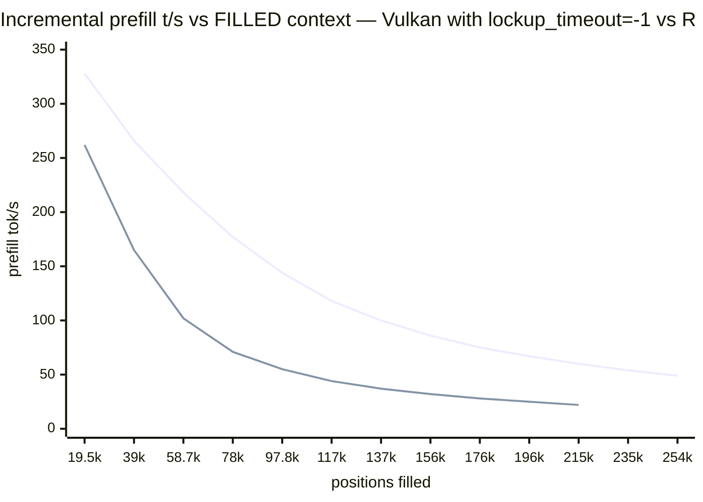

# Backends — Vulkan vs ROCm (and ecosystem comparisons)

> From [Qwen3.8-27B on Strix Halo](../README.md) — the measured A/B, speed and stability pictures, comparisons with sibling projects, the HIP build.

## Vulkan vs ROCm, which and why?

Two GPU backends can drive the 8060S on Linux: **Vulkan** (via Mesa RADV — what
this repo ships by default) and **ROCm/HIP** (AMD's compute stack). On Strix
Halo the internet folklore says "ROCm is way slower than Vulkan" — that was
true for the *official* ROCm releases (7.2.x era) but is **no longer true for
the 7.14+/TheRock line**, and we measured it. This chapter is the plain-language
tour of what we ran, what died, and what we now run for which job.

### What we actually compared (all on this box, same models)

Every number below comes from the same experiment rig: identical fork commit
(`9b9ac3e38` unless noted), identical models (Q8 target + DFlash2 draft, f16 KV,
`-c 262144 -b/-ub 4096 -fa on`), identical battery
([`fill_battery.sh`](../scripts/fill_battery.sh) — grows the context in 16k-token chunks
through cached prefixes, i.e. true incremental fill). Only the backend — or the
build — changes between rows. The A/B CSVs, server logs, and the 16k-token
fill corpus are committed under `results/` (the repo's `.gitignore` hides the
full ~80-file research tree; only the evidence set is versioned).

**The four builds we tested:**

1. **Fork, Vulkan** — our production build (the strix-halo-vulkan fork's tuned
   Vulkan path: coopmat matmuls, wave32, LDS pad tuning).
2. **Fork, ROCm** — same fork commit, HIP backend, built against **TheRock
   7.15.0a nightly** (AMD's rolling source releases; userspace-only, no root).
3. **Stock upstream master, Vulkan** — plain `ggml-org/llama.cpp` at `2115b73`
   (2026-08-22), to answer "maybe the newest upstream already fixed it?"
4. **Fork HEAD, Vulkan** — the fork's newest commits (incl. a fresh Vulkan
   coopmat-pad gating fix), to answer the same for the fork.

### The speed picture

Bare bench (`llama-bench`, pp512 = prompt processing, tg32 = generation):

| Build | Q6 pp512 | Q6 tg32 | Q8 pp512 | Q8 tg32 |
|---|---:|---:|---:|---:|
| Fork Vulkan (production) | 360.6 | 8.78 | 365.0 | 7.27 |
| Fork ROCm TheRock 7.15 | 352.5 | 8.57 | **370.8** | 7.18 |
| Stock master Vulkan | 316.9 | 8.78 | — | — |

Decode with speculative decoding (Q6 @ 128k, fresh context, n=3 probes per
cell, medians with min–max; raw rows in
[`results/spec-battery-n3.csv`](../results/spec-battery-n3.csv)):

| Combination | sustained decode | draft acceptance |
|---|---:|---:|
| Vulkan + DFlash2 | **16.7 t/s** (16.57–16.91) | 0.29 |
| Vulkan + MTP | 15.1 t/s (14.85–15.12) | 0.32 |
| ROCm + MTP | 14.5 t/s (14.48–14.59) | 0.33 |
| ROCm + DFlash2 | 14.2 t/s (14.07–14.32) | 0.34 |

*Probe shape: fresh context, short prompt, 256 generated tokens. Draft
acceptance sits ~0.3 on this shape vs ~0.38 on real router traffic, which is
why the intro's 15–35 t/s band is wide. The ranking is the
point of this table, not the absolutes.*

Read it straight: **on the TheRock 7.15 line, ROCm reaches parity** (Q8 prefill
even ahead) — the "way slower" folklore belongs to the official 7.2.x releases
(upstream tracks those gaps: [#21284](https://github.com/ggml-org/llama.cpp/issues/21284),
[#24437](https://github.com/ggml-org/llama.cpp/issues/24437)). With
speculation armed, Vulkan+DFlash2 stays the fastest combination; MTP is viable
everywhere and actually *prefers* ROCm here. (halofpx's much higher MTP numbers
come from a 13.5 GiB FP4 quant — half our weights; see the comparison below.)

### The stability picture — where the ~128–160k wall actually lives

Same battery, deep fill, fate of the server:

| Build | filled positions at death | signature |
|---|---:|---|
| Fork Vulkan (production pin) | **died at 136,965** | `vk::Queue::submit: ErrorDeviceLost` |
| Fork HEAD Vulkan | died in the 117k–137k band | same |
| Stock master Vulkan (`-ub 4096`) | **died at 19,571** (!) | same |
| Stock master Vulkan (`-ub 1024`) | died in the 39k–58k band | same |
| Fork ROCm TheRock 7.15 | **survived 215,228 filled — zero errors** (two runs: run 1's chunk-12 client-timeout cancelled at 98% progress ≈ 234k filled server-side; run 2 stopped manually mid-chunk-10 — server healthy both times) | — |
| Fork Vulkan + `amdgpu.lockup_timeout=-1` | **survived 254,356 filled = full window** (2026-08-23 intervention run; rejected only the one-chunk-overflow request past the window with a clean 400) | **none — zero kernel ring events** |

*Note on the stock rows: they ran without a draft model — stock's loader
rejects the fork-format DFlash2 draft (`wrong number of tensors; expected 81,
got 58`, [log](../results/stock-dflash-loadfail.log)) — so stock-vs-fork differs
in build **and** spec path; the fork-HEAD row is the clean same-spec
comparison.*

Three findings worth internalizing:

- **The wall is real but its mechanism is the amdgpu lockup watchdog, not
  (only) a Vulkan driver bug.** Kernel forensics (2026-08-23): the journal
  shows **exactly four `ring comp_*.0 timeout → ring reset` events on
  2026-08-22, 09:39–10:38 — the precise window of the four Vulkan
  device-lost deaths above, 1:1, and nothing else in the window**. The first
  names our process (`Process llama-server pid 21320`); the server log dies
  at the same wall-second (`radv/amdgpu: The CS has been cancelled … This
  context is innocent` → `device lost` → task 51 stops at 136,965).
  Mechanism (INFERRED): a single deep-position dispatch goes quiet past the
  ring timeout — dispatch duration grows with KV depth until it crosses the
  threshold, which is why two independent fork runs died at the *identical*
  136,965. Healthy chunks of 60–144 s never tripped it (many short,
  progress-signaling submissions), so the trigger is one long no-signal
  dispatch, not total runtime.
- **Community confirmation (REPORTED → now VERIFIED here, 2026-08-23)**:
  the intervention test ran on this box — kernel cmdline
  `amdgpu.lockup_timeout=-1` (systemd-boot entry, backup kept), same
  battery: **254,356 positions filled = the entire usable window in 45 min,
  zero device-lost, zero kernel ring events** (journal confirms
  `amdgpu: lockup timeout disabled` at boot). The twice-deterministic
  136,965 death is gone → causation established, not just correlation.
  Cost model of `-1` (reported by the same user): a *true* GPU hang then
  needs a reboot — acceptable headless, a real tradeoff on a desktop. A
  middle path (`lockup_timeout=600000`, 10 min) keeps some recovery and
  would very likely also clear our ~2 s-class false positive, at the cost
  of unverified-by-us behavior on 10-minute dispatches. Our unattended-
  stability setup for living with `-1` (hardware TCO + GPU canary + scoped
  reboot grant): the
  [playbook chapter](DEEP-CONTEXT.md#stability-without-the-kernel-gpu-watchdog-lockup_timeout-1-playbook).
- **Why ROCm survived (INFERRED)**: the HIP path splits the same math into
  differently-shaped submissions that keep signaling progress — so the
  watchdog never fires — rather than being immune to the underlying depth
  cost. The q8_0-KV/`-ub 1024` shape shifts (fork issue #9 user) likely move
  the same threshold rather than remove it.
- **Bleeding edge does not fix it (yet)**: neither upstream master nor the
  fork's newest commits move the needle. In fact **stock master is 7× worse**
  than our fork build — the fork's tuned Vulkan path is what carries you from
  ~20k to ~137k. Do not swap our build for stock on this APU.
- **The crash is config-shaped, not absolute**: `-ub 1024` stretched stock's
  life 2–3× (and the fork-issue-#9 user prefilled 491,520 tokens on Vulkan
  with q8_0 KV + `-ub 1024` on DeepSeek-V4). With the watchdog mechanism, the
  suspects reorder: the real dial is *single-dispatch duration at depth* —
  which `-ub`, KV dtype, and `lockup_timeout` all move. Upstream still has
  the class open
  ([#27076](https://github.com/ggml-org/llama.cpp/issues/27076),
  [#27458](https://github.com/ggml-org/llama.cpp/issues/27458)); those
  reports are plausibly the same watchdog mediation.

### The chart: context-filling decay, deep into the 256k window

Prompt-processing speed while the context fills (same 16k chunks, same
flags; Q8 + DFlash2 + f16 KV). With the default kernel, **Vulkan's prefill
edge widens with depth (1.25× at 20k → 2.7× at ~117k) — until the amdgpu
watchdog kills it at ~137k.** With `amdgpu.lockup_timeout=-1` the same run
sails through the death zone and fills the **entire window** (2026-08-23
intervention run: 254,356 positions — window boundary, not a crash — in
45 min, zero errors, zero kernel ring events). ROCm decays faster in
absolute terms and survives on the default kernel:



*(upper line = Vulkan, `lockup_timeout=-1` — the 2026-08-23 full-window run;
it matches the killed run's curve within ±1 t/s at every shared depth, then
continues 6 more chunks past the old 136,965 death. Lower line = ROCm
TheRock 7.15 through 215k. Decode speed decays with filled depth on both
backends — see the
fill-decay table in the 1M chapter.)*

### So which one, and why?

- **Daily driving (≤ ~100k of content): stay on Vulkan.** Faster decode with
  DFlash2 (16.7 vs 14.2 t/s), 1.25–2.7× faster prefill by depth, one build, zero extra
  setup — that's what `run_llama-server.sh` and the recipes assume.
- **Deep context (> ~128k filled): set `amdgpu.lockup_timeout=-1`** —
  verified to fill the entire 262k window on Vulkan with zero errors, keeping
  Vulkan's prefill lead at every depth
  ([deep-positions A/B](DEEP-CONTEXT.md#deep-positions-the-amdgpu-watchdog-wall--and-how-to-remove-it),
  [stability playbook](DEEP-CONTEXT.md#stability-without-the-kernel-gpu-watchdog-lockup_timeout-1-playbook)).
  **The ROCm build is the fallback** when the kernel cmdline can't be touched:
  same models/flags/recipes, survives the band on the default kernel, 1.25–2.7×
  slower prefill.
- **Watch, don't switch, on stock upstream** — its Vulkan path is strictly
  worse on this APU today (and its `draft-dflash` loader can't even read the
  DFlash2 draft: "wrong number of tensors; expected 81, got 58" — the selector
  format is fork-specific).
- **MTP is the portable speculation option** (works on both backends, no
  separate draft weights), but on Vulkan DFlash2 beats it 16.9 vs 13.1 t/s —
  keep DFlash2 where it works, MTP where it doesn't.

### How this compares with sibling projects

*Each comparison pins the other repo's state; re-check against their
current tip before relying on any number. The at-a-glance table first,
then per-project notes.*

| Project | What it is | Fits our gfx1151 today? | Overlap with us | Verdict for us |
|---|---|---|---|---|
| [halofpx](https://github.com/julianmb/halofpx) | Strix-Halo model-zoo server, hand-tuned ROCmFP4/FP8 quants + MTP | ✅ (ROCm path) | recipes/quant philosophy (opposite corner: speed-first) | measured-quality-first contrast, pinned 2026-08-22 (below) |
| [ds4 (DwarfStar)](https://github.com/antirez/ds4) | DSV4-Flash/GLM-5.2 specialty engine; two-Halo layer-split; SSD expert streaming | ✅ **builds first-try** on our boxes (TheRock 7.15, `make strix-halo`) | the big-model/two-Halo frontier | bake-off candidate C′; quant download pending |
| [vllm.cpp](https://github.com/mudler/vllm.cpp) | vLLM serving core in one C++ binary (continuous batching, RadixAttention) | ❌ Vulkan #125 / ROCm skeleton / #937 | multi-client serving — our e5 question, properly | watch (Phase D); smoke on AMD-integrated support |
| [FreeToken](https://github.com/FlashML-org/FreeToken) | Edge-native MoE serving: CPU–GPU co-execution, expert caching, semantic-anchor KV edits; 290B+ MoE on consumer rigs | ❌ NVIDIA-first (RTX 30/40/50); **AMD = open PRs** (#60/#23/#53/#132, RDNA3/4 ports in flight) | DSV4-Flash big-model goal — same payload, different engine; the i9/4090Ti backend could run it TODAY | watch for gfx1151; pilot on the i9 when it joins the fleet |
| [Lemonade](https://github.com/lemonade-sdk/lemonade) | AMD-backed local-AI server: OpenAI/Anthropic/Ollama APIs, model manager, GGUF+ONNX, NPU/GPU/CPU; **`vllm`+`rocm` device combo explicitly targets gfx1151 (Linux)** | ✅ (AMD engineers optimize for Strix Halo) | serving layer/UX more than inference core; NPU (XDNA2) is a surface we don't touch | candidate for the fleet's "easy on-ramp" lane; A/B its vllm-rocm path vs our router on the same weights |

**Per-project notes** (what we'd measure, and the honest caveats):

- **ds4** — the closest goal-overlap (DSV4-Flash on Halos). Their STRIXHALO.md
  recipe + our TheRock 7.15 = builds clean. Comparison that matters: their
  ds4f-q2 imatrix quant (experts IQ2_XXS/Q2_K, rest untouched) served by ds4
  vs Unsloth UD-IQ3_S served by llama.cpp fork — same box, our E2 tier-1
  battery as judge, t/s alongside.
- **vllm.cpp** — right engine, wrong platform status for us. Their benchmark
  discipline (token-exactness, SUPERSEDED labels) is the culture match; the
  GB10 DSV4 numbers (16.3–18.7 t/s) are our halo ballpark target when AMD
  support lands.
- **FreeToken** — the engineering ideas are relevant even before AMD support:
  bandwidth-adaptive CPU–GPU co-execution is the principled version of our
  `-cmoe` paging insight; semantic-anchor checkpoints (context edits without
  recompute) would directly attack our agent-loop re-prefill costs; LRU
  expert caching = our page-cache argument, made explicit. Watch the ROCm
  PRs (#132 RDNA3/4 runtime foundation is the one to track); note their
  pull is NVIDIA-tuned kernels, so even merged, gfx1151 perf is an open
  question. The fleet's heterogeneous lane (i9/RTX) could trial it sooner.
- **Lemonade** — different layer than us: they aggregate backends (incl.
  llama.cpp-family and vllm) behind a friendly server + model manager, with
  AMD doing the optimizing. No deep conflict: our fleet could *be* a
  lemonade backend; or lemonade could be the on-ramp for non-tinkerer users
  of the fleet. The one measurable claim worth checking: their
  `vllm`+`rocm` gfx1151 combo vs our fork router on the same GGUF.

*And the standing rule: no number below is ours unless labeled OBSERVED;
sibling claims are REPORTED and commit-pinned where we checked them.*

Repos compared at this date: **halofpx** [`22dd3b54d`](https://github.com/julianmb/halofpx/commit/22dd3b54d)
("feat(registry): mandatory quant provenance metadata" — they have started
requiring quant provenance metadata, a step in the right direction) vs **this
repo** [`5569eb2`](https://github.com/PieBru/Qwen-3.8-27B_Strix-Halo_gfx1151/commit/5569eb2)
(the commit carrying the experiments above; you are reading its descendant).
halofpx moves fast — re-check their numbers against their own current tip
before relying on them.

[halofpx](https://github.com/julianmb/halofpx) is the speed-first cousin of
this repo: a slick model-zoo server for Strix Halo built around hand-tuned
**ROCmFP4/FP8 quants**, MTP, and a Vulkan-decode + ROCm-prefill split. We
measured nothing against it on this box (its weights are a separate download);
this is a methodology comparison from their published numbers:

- **Their speed is real but bought with quantization.** Their Qwen3.8-27B
  default (`ROCmFP4_FAST`, 13.55 GiB, 4.26 bpw) decodes at 14.0 t/s bare /
  30.6–36.0 t/s with MTP. Half-size weights on a bandwidth-bound APU *should*
  be ~2× faster — that's the trade, not magic. Our Q6/Q8 recipes trade that
  speed away for fidelity.
- **Quality verification is thin where it matters.** Their published
  perplexity is one number for *Ornith* (5.95 vs Q4_K_M's 5.64 — and the ±0.3
  error bars nearly touch), measured on **9 chunks of wikitext-2 at n_ctx=512**
  (~4.6k tokens). No perplexity is published for the Qwen FP4_FAST default at
  all, and **no KLD-vs-reference anywhere** — the metric that catches the
  drifts perplexity misses. Our spread (Q8 4.692 → Q6 4.706 on 200×512-token
  chunks of a real corpus, KLD-checked) is an order of magnitude tighter than
  the gap their own table shows for FP4.
- **"Validated 262K" is the MoE sibling, not this model.** Their 262,144-token
  validation load is Ornith 1.5 35B; their Qwen context table stops at 32k.
- **Fork-format lock-in**: ROCmFP4/FAST GGUFs load only on their fork lineage —
  a self-published format with one implementation. Standard K-quants (ours)
  load everywhere, forever.

Nothing wrong with choosing that point on the speed/quality curve *knowing
you chose it* — but this repo's contract is measured-quality-first: every
recipe we ship carries its PPL/KLD price tag, and we don't deliver formats
whose fidelity we haven't measured ourselves.


## Optional: HIP variant (ROCm build)

Two ways to get a ROCm/HIP binary — for when you need the deep-context escape
hatch (see [Vulkan vs ROCm](#vulkan-vs-rocm-which-and-why)):

- **TheRock nightly (recommended, 2026-08-22 measured)** — userspace-only,
  no root, sits in `~/opt`; reaches Vulkan bench parity and survives fills
  past 215k on the default kernel (where Vulkan hits the amdgpu watchdog
  wall). Full recipe in
  [the deep-positions A/B](DEEP-CONTEXT.md#deep-positions-the-amdgpu-watchdog-wall--and-how-to-remove-it).
  ⚠️ Avoid the `v2/gfx1151` wheel feed's 7.14.0a20260609..0612 builds — they
  segfault in `hsa_init` on gfx1151 (TheRock issue #5763); use
  `tarball-multi-arch/` builds (7.15.0a20260728 verified here).
- **Official ROCm 7.2.4** (pacman `rocm-hip-sdk`) + the fork's
  `fa-tile-dequant-on-load` branch — the older path, kept for reference; expect
  the "way slower than Vulkan" behavior of pre-7.14 ROCm:

```bash
git clone https://github.com/Nathanw1014/llama.cpp && cd llama.cpp
git checkout fa-tile-dequant-on-load
cmake -B build-hip -DGGML_HIP=ON -DAMDGPU_TARGETS=gfx1151 \
      -DCMAKE_BUILD_TYPE=Release -DLLAMA_CURL=OFF
cmake --build build-hip --target llama-server llama-cli llama-bench -j
```

