# Qwen3.8-27B — the official benchmark card, charted

> From [Qwen3.8-27B on Strix Halo](../README.md) — Qwen's own published
> numbers for this model, organized into four category charts, with our
> quant-equivalence note. All values are **REPORTED** (Qwen model card,
> pinned 2026-08-24) — nothing here was measured by us; our own batteries
> live in [FINDINGS](FINDINGS.md).

The model card compares **Qwen3.8-27B** against its predecessor
(Qwen3.6-27B), the previous-gen cloud Plus tier (Qwen3.7-Plus), a same-
class open model (Muse Glimmer-30B), and a frontier closed model
(Opus4.6 Max).

## Quant equivalence note (why these charts describe OUR box)

Qwen measured with the original **BF16** weights. We serve the
**UD-Q8_K_XL quant** — and our committed tie-battery
([FINDINGS](FINDINGS.md), 2026-08-21) measured the Q8 quant at
**+0.014 PPL / 0.0073 KLD** vs the BF16 reference: statistically
near-identical. **The charts below are, to first order, the scores of the
model this repo serves** — with two caveats: (1) our smaller quants
(Q6/Q5) pay a small quality delta (also measured — same battery); (2) a
couple of chart rows are setup-dependent (thinking mode / CI tooling —
noted where the gap could bite).

## Chart 1 — Coding & Software Engineering

```mermaid
xychart-beta
    title "Coding & SWE — series: Qwen3.8-27B / Qwen3.6-27B / Qwen3.7-Plus"
    x-axis ["TB 2.1", "SWE-Pro", "NL2Repo", "DeepSWE", "QwenSWE", "LCB v6"]
    y-axis "score" 0 --> 100
    bar [73.0, 61.7, 42.3, 42.2, 79.0, 90.3]
    bar [63.4, 53.5, 36.2, 13.3, 49.3, 83.9]
    bar [64.0, 57.6, 41.1, 14.2, 59.2, 89.6]
```

*Bars left→right match the series order in the title (`xychart-beta` has no legend yet); the table below is the precise reference.*

| Benchmark | Category | Qwen3.8-27B | Qwen3.6-27B | Qwen3.7-Plus | Muse Glimmer-30B | Opus4.6 Max |
|---|---|---|---:|---:|---:|---:|
| Terminal Bench 2.1 | Agentic Terminal Coding | **73.0** | 63.4 | 64.0 | 51.7 | **78.2** |
| SWE-bench Pro | Agentic Coding | **61.7** | 53.5 | 57.6 | 51.2 | 53.4 |
| NL2Repo-Bench | Repo-Level Code Gen | 42.3 | 36.2 | 41.1 | — | **47.6** |
| DeepSWE 1.1 | Agentic Coding | **42.2** | 13.3 | 14.2 | — | — |
| QwenSWEBench | Software Engineering | **79.0** | 49.3 | 59.2 | — | 63.8 |
| LiveCodeBench v6 | Competitive Coding | **90.3** | 83.9 | 89.6 | — | 88.8 |

*Comment:* the coding jump is the headline — **SWE-bench Pro +8.2 over
its own predecessor and +8.3 over the previous-gen Plus tier**, DeepSWE
**3.2×** the previous generation. On agentic coding the 27B-dense
generation leapfrogged the prior cloud tier; only the frontier Opus
still leads on terminal work and repo-level generation. This is the
competence class our E2 coding battery and E3 agent episodes probe
locally — the official card and our kitchen-table batteries agree on the
shape (ceiling-class coding at this size).

## Chart 2 — General & Reasoning

```mermaid
xychart-beta
    title "General & Reasoning — series: Qwen3.8-27B / Qwen3.6-27B / Qwen3.7-Plus"
    x-axis ["CoWork", "Job", "ALE", "IF", "GPQA", "HLE"]
    y-axis "score" 0 --> 100
    bar [70.7, 33.4, 42.9, 79.5, 89.2, 30.8]
    bar [61.0, 21.8, 27.3, 69.1, 87.8, 24.0]
    bar [65.1, 27.6, 33.6, 79.1, 90.3, 34.7]
```

*Bars left→right match the series order in the title (`xychart-beta` has no legend yet); the table below is the precise reference.*

| Benchmark | Category | Qwen3.8-27B | Qwen3.6-27B | Qwen3.7-Plus | Muse Glimmer-30B | Opus4.6 Max |
|---|---|---|---:|---:|---:|---:|
| CoWorkBench | Long-Horizon Office Work | **70.7** | 61.0 | 65.1 | — | 68.2 |
| JobBench | Professional Job Tasks | **33.4** | 21.8 | 27.6 | — | — |
| Agents' Last Exam | Pass@1 / Score | **20.4 / 42.9** | 10.6 / 27.3 | 13.2 / 33.6 | — | — |
| IFBench | Instruction Following | **79.5** | 69.1 | 79.1 | 77.0 | 62.5 |
| GPQA Diamond | Scientific Reasoning | 89.2 | 87.8 | 90.3 | 83.5 | **91.3** |
| HLE | Multidisciplinary Reasoning | 30.8 | 24.0 | 34.7 | 22.0 | **40.0** |

*Comment:* instruction following and long-horizon work are clear wins
over both the predecessor and the Plus tier — long-horizon office work
(+9.7 over predecessor) is exactly the workload our agent runs. On the
hardest pure-reasoning rows (GPQA, HLE) the ordering flips to
frontier-model territory — consistent with our E2c frontier battery
finding: the 27B holds a high but real ceiling; at extreme difficulty
the gap to frontier shows (and budget exhaustion, not capability, was
our measured failure mode).

## Chart 3 — Agentic Multimodal Intelligence

```mermaid
xychart-beta
    title "Agentic Multimodal — series: Qwen3.8-27B / Qwen3.6-27B / Qwen3.7-Plus"
    x-axis ["OSWorld", "WebArena", "Android", "Recreation", "ClawEval", "SWE-MM", "V2Web"]
    y-axis "score" 0 --> 100
    bar [84.3, 64.8, 81.9, 47.1, 56.9, 38.6, 62.9]
    bar [63.9, 48.8, 70.3, 29.8, 50.4, 25.7, 45.0]
    bar [73.3, 55.3, 81.0, 30.2, 60.1, 30.0, 42.1]
```

*Bars left→right match the series order in the title (`xychart-beta` has no legend yet); the table below is the precise reference.*

| Benchmark | Category | Qwen3.8-27B | Qwen3.6-27B | Qwen3.7-Plus | Muse Glimmer-30B | Opus4.6 Max |
|---|---|---:|---:|---:|---:|---:|
| OSWorld-Verified | Computer Use | **84.3** | 63.9 | 73.3 | 65.9 | 72.7 |
| WebArena-Verified | Browser Use | **64.8** | 48.8 | 55.3 | — | — |
| AndroidWorld | Mobile Use | **81.9** | 70.3 | 81.0 | — | 62.0 |
| RecreationBench | Application Recreation | **47.1** | 29.8 | 30.2 | — | — |
| ClawEval-MM | Pass@3 / Avg | 57.4 / 56.9 | 42.6 / 50.4 | **57.4 / 60.1** | — | 52.5 / 54.7 |
| SWE-MM | Multimodal SWE | **38.6** | 25.7 | 30.0 | — | 27.1 |
| Vision2Web | Visual Web Dev | **62.9** | 45.0 | 42.1 | — | — |

*Comment:* computer-use and browser-use are the generation's biggest
jumps (+20.4 OSWorld over the predecessor, **+11.6 over Opus**) — the
27B leads the entire comparison field on GUI action. Caveat for us:
these numbers imply the full vision stack (mmproj); our vision recipe
serves that path but at reduced speed — the scores transfer, the
latency budget does not.

## Chart 4 — General Multimodal & Perception

```mermaid
xychart-beta
    title "Perception (standard setup) — series: Qwen3.8-27B / Qwen3.6-27B / Qwen3.7-Plus"
    x-axis ["MathVis", "BabyVis", "CharXiv", "OmniDoc", "RWQA", "ERQA"]
    y-axis "score" 0 --> 100
    bar [90.0, 65.7, 83.7, 91.1, 85.9, 65.5]
    bar [85.1, 28.9, 78.4, 89.4, 84.1, 62.5]
    bar [90.3, 64.7, 85.8, 91.4, 86.9, 69.8]
```

*Bars left→right match the series order in the title (`xychart-beta` has no legend yet); the table below is the precise reference.*

| Benchmark | Setup | Qwen3.8-27B | Qwen3.6-27B | Qwen3.7-Plus | Muse Glimmer-30B | Opus4.6 Max |
|---|---|---|---:|---:|---:|---:|
| MathVision | Standard / With CI | 90.0 / **94.6** | 85.1 | 90.3 | — | 65.5 |
| BabyVision | Standard / With CI | 65.7 / **85.6** | 28.9 | 64.7 / 70.4 | — | 12.6 |
| CharXiv (RQ) | Standard / With CI | 83.7 / **90.2** | 78.4 | 85.8 / 85.9 | 78.8 | 66.0 |
| OmniDocBench 1.5 | Doc Intelligence | 91.1 | 89.4 | **91.4** | 75.8 | 86.6 |
| RealWorldQA | Real Perception | 85.9 | 84.1 | **86.9** | — | 73.9 |
| ERQA | Embodied Intel. | 65.5 | 62.5 | **69.8** | — | 40.8 |

*Comment:* perception is where the 27B and the prior Plus tier are
nearest-peers (doc intelligence and real-world QA within a point). The
"With CI" columns (chain-of-insight tooling) add +4 to +20 points —
reminder that several card rows measure the *harness*, not just the
weights; our serving equivalent of "CI" is the reasoning-effort +
tools stack we measured in E1/E3.

## Head-to-head vs the frontier (Opus4.6 Max)

```mermaid
xychart-beta
    title "vs the frontier — series: Qwen3.8-27B / Opus4.6 Max"
    x-axis ["TB 2.1", "SWE-Pro", "NL2Repo", "OSWorld", "Android", "GPQA", "HLE"]
    y-axis "score" 0 --> 100
    bar [73.0, 61.7, 42.3, 84.3, 81.9, 89.2, 30.8]
    bar [78.2, 53.4, 47.6, 72.7, 62.0, 91.3, 40.0]
```

*The 27B's profile vs a frontier model: wins agentic-GUI rows decisively,
trades coding, concedes the hardest pure-reasoning rows — the same shape
our E2c frontier battery measured.*

---

## Reading the card from a desk

1. **Coding/agentic is the model's identity** — the family's biggest
   generational jumps, and the reason this repo's daily driver is a
   coding-tuned recipe.
2. **It trades blows with last-gen cloud Plus** — wins coding, agentic,
   IF; loses only at HLE-class pure reasoning.
3. **Vision/GUI numbers need the vision stack and patience** — scores
   transfer to our mmproj recipe; speed does not (see RECIPES).
4. **All values are the vendor's** — REPORTED, pinned to the 2026-08-24
   model card; our locally-measured equivalents (with the same honest
   labels) are in [FINDINGS](FINDINGS.md), and the external
   Artificial-Analysis datapoint corroborating this model's rank is in
   [WHY](WHY.md#external-validation--where-this-model-stands-reported).
