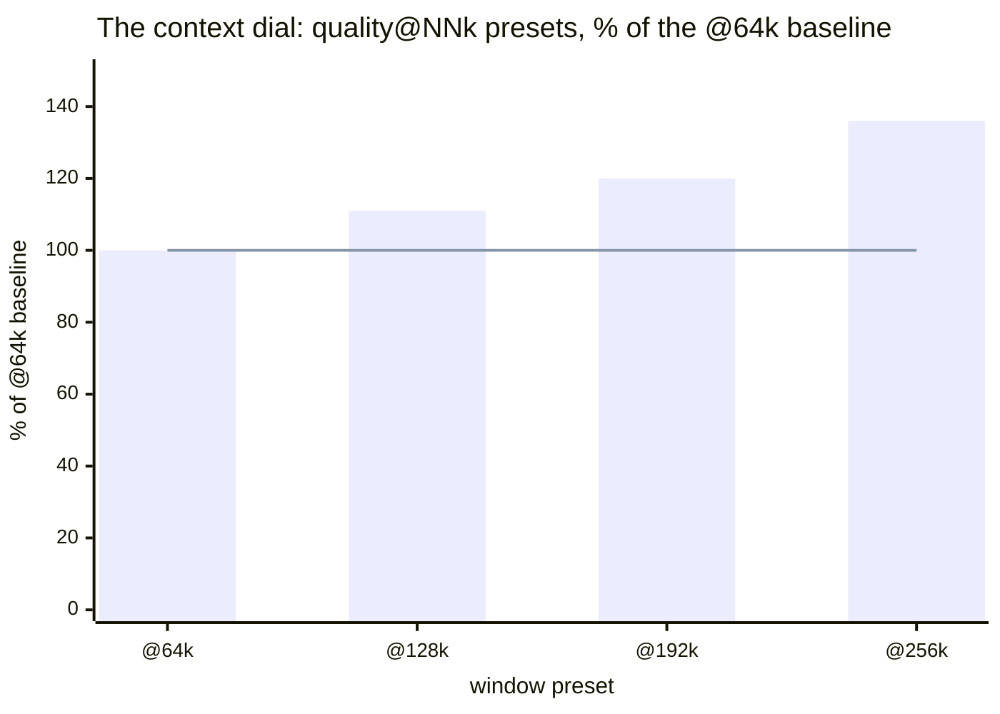

# The recipe menu

> From [Qwen3.8-27B on Strix Halo](../README.md) — which preset for which goal, the context dial, and the column notes.

## Recommended configs (per goal)

**Choosing is easier than it looks.** Five recipes cover the whole menu, and
the names are the decision: you are picking a *role*, not decoding a config.
Three questions settle it:

1. **Is quality the point, or is it tokens-per-second?** Quality work
   (final documents, careful synthesis, unattended batches) → `quality`
   (Q8). Everything interactive → `balanced` (Q6): ~17–21 t/s decode, and
   its measured quality cost is a rounding error (PPL +0.3%, KLD 0.0073).
2. **Do you need a window bigger than 64k?** The window is a *dial*, not a
   recipe choice — every `quality@NNk` preset is the same weights and
   speed; `NN` only sets the ceiling and its RAM price. Balanced defaults
   to 128k (agentic-sized) for free.
3. **Anything special?** Coding agents → the `coding` recipe (balanced +
   a measured reasoning-budget guard). Raw churn → `speed` (Q5, fastest
   decode, documented quality cost). Images → `vision` (the only
   multimodal recipe, no spec decode by design — lesson #7).

The table (all values measured and evidence-linked; full column notes below):

| Goal | Router recipe (`models.ini`) | Command (`run_llama-server.sh …`) | context | RAM (GiB) | left (GiB) | tg (t/s) | pp4k (t/s) | PPL / KLD↑ |
|---|---|---|---|---:|---:|---:|---:|---:|
| **Quality @256k** | `Qwen38-27B-quality@256k` | router-only (Q8 @ 256k) | 262144 (servable ceiling) | ~61 | ~63 | ~25 | ~330 | 4.692 / ref |
| **Quality** | `Qwen38-27B-quality@64k` (+`@96k`, `@128k`, `@192k`) | `--goal quality` (Q8) | 65536 window; presets to 256k | ~45 | ~78 | ~25 | ~330 | 4.692 / ref |
| **Balanced** | `Qwen38-27B-balanced` (+`@96k` fence variant) | `run_llama-server.sh` (Q6) | 131072 window (agentic-sized); flat to 256k | ~42 | ~80 | **~17–21** | ~306 | 4.706 / 0.0073 |
| **Coding** | `Qwen38-27B-coding` (alias `coding`) | router-only (Q6, 128k, reasoning-budget 2048) | 131072 | ~42 | ~80 | ~17–21 | ~306 | 4.706 / 0.0073 |
| **Speed** | `Qwen38-27B-speed` | `--goal speed` (Q5, n-max 5) | 65536 | ~35 | ~88 | **~23** | ~297 | 4.722 / 0.0137 |
| **Vision** | `Qwen38-27B-vision` | router-only (mmproj, no spec) | 65536 | ~32 | ~91 | ~8.4 | — | 4.706 / 0.0073 |

**Coding = balanced + a measured guard.** Same Q6 weights, window and
speed as balanced; the only difference is a server-side
`reasoning-budget 2048` default — insurance against the one failure mode
the reasoning batteries actually found: thinking that eats a bounded
`max_tokens` whole and returns an *empty* answer (60–70% of frontier items
at a 4k budget). 2048 sits above hard-routine thinking p90 (~610–736), so
normal work never touches it. Override per request: body
`reasoning_budget_tokens` — `32768` for effectively-unrestricted deep work,
`0` to end thinking immediately, absent/`-1` inherits 2048. Rationale and
verifications: models.ini `[Qwen38-27B-coding]` section comment and the
[reasoning chapter](REASONING.md).

**The context dial.** All `quality@NNk` presets are the same weights, quality
and decode speed — allocation is free (headline #1), so `NN` buys only the
window and its RAM price (~45 → ~61 GiB from @64k to @256k). Switch presets
per **request**, even mid-session: standard clients resend the full history
every call, so the new preset's first request rebuilds ("renews") the context
after one ~6–15 s on-demand load — verified with a needle set on @64k and
recalled on @192k. For fully-local users this makes the context window a
dial much like the reasoning-level switch (none/low/medium/high), trading
free RAM for window on the fly; `--models-max 1` serializes the switch (the
old preset unloads first — switch between requests, not during one).

Bars = RAM occupied; line = decode speed (quality is likewise flat) — the window
costs memory and nothing else. (Fill-depth decay, above, is the separate price
of actually *using* the window.)
