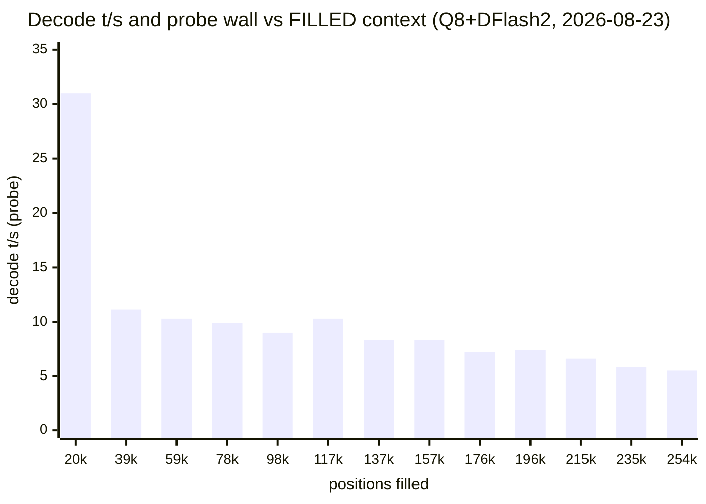

# Running it — operations guide

> From [Qwen3.8-27B on Strix Halo](../README.md) — the router, recipes deep-dive, pairing with pi, the 24/7 margin rule, verification.

## Recipe deep-dive (continued from the [recipe menu](RECIPES.md) table)

**Two measured realities temper the dial** (re-measured end-to-end
2026-08-23, Q8 `quality@256k`-shape standalone, DFlash2, f16 KV — raw CSV
[`results/e4-decay.csv`](../results/e4-decay.csv)): decode falls with FILLED
depth — **~10 t/s by 78k filled → ~8 @137–157k → 5.5 @254k** (probe wall
per 256 tokens rises monotonically 8.8 s → 48.0 s; incremental prefill
likewise: 324 → 143 t/s from 20k to 98k depth, 49 at 254k) — and on a
**default kernel**, content beyond ~128k positions dies at the amdgpu
watchdog (death measured at **136,965** filled; forensics in the
Vulkan-vs-ROCm chapter). With `amdgpu.lockup_timeout=-1` (this box,
2026-08-23) the same battery fills the whole window — **254,356 positions,
zero errors** — so `@192k`/`@256k` are real, usable windows, priced in
prefill/decode time at depth, not in crashes. Default-kernel boxes: plan
~128k of real content.

Measured decode vs fill (`quality@256k` shape, Q8 + DFlash2, temp 0,
256-token probes per depth, `ignore_eos`, 2026-08-23 re-measure — the
2026-08-21 table's absolute values had no committed raw logs and are
superseded by this pass; the shape matches):

| Positions filled | % of 256k window | prefill (t/s) | decode tg (t/s) | probe wall (s/256 tok) |
|---:|---:|---:|---:|---:|
| 19,567 | 7% | 323.7 | 31.0 | 8.8 |
| 39,138 | 15% | 263.4 | 11.1 | 23.6 |
| 58,709 | 22% | 216.6 | 10.3 | 25.5 |
| 78,280 | 30% | 176.4 | 9.9 | 26.6 |
| 97,851 | 37% | 143.5 | 9.0 | 29.2 |
| 117,422 | 45% | 118.3 | 10.3 | 25.6 |
| 136,993 | 52% | 99.5 | 8.3 | 31.9 |
| 156,564 | 60% | 85.3 | 8.3 | 32.0 |
| 176,135 | 67% | 74.9 | 7.2 | 36.5 |
| 195,706 | 75% | 66.6 | 7.4 | 35.7 |
| 215,277 | 82% | 59.9 | 6.6 | 39.8 |
| 234,848 | 90% | 54.1 | 5.8 | 45.4 |
| 254,419 | 97% | 49.3 | 5.5 | 48.0 |

Single probes per depth: DFlash2 draft acceptance on the story-probe spans
0.26–0.93 across depths (server-log join), so decode-t/s rows scatter ±3×;
the **wall column is the clean monotonic signal** (same 256 tokens, same
shape, rising 5.5× from shallow to full window). Prefill decays smoothly
throughout — it has no acceptance term.



The old table's "~160k death row" is the default-kernel story (that fill
died en route — later root-caused to the amdgpu watchdog at 136,965). With
`amdgpu.lockup_timeout=-1` this pass filled to 254,419 with zero errors;
the price at depth is time, not death.

When to pick which:

- **Quality @256k** — the flagship window: the servable ceiling, for many/long
  contexts. One ≥128k-position prompt is fine **with** `lockup_timeout=-1`
  (full-window fill verified 2026-08-23); on a default kernel it is a crash
  (watchdog death band ~137k). Loads can be slow on an uptimed box. Same weights/quality/speed as Quality @64k — the
  difference is purely RAM for window (see the context-dial note above).
- **Quality (@64k) — correctness-first answers, code, synthesis; the
  `@96k`/`@128k`/`@192k`/`@256k` presets are one model-field away when the window is
  needed — pick your standing window by your own usage. `@96k` is the **fence**
  variant: identical speed (allocation-flat), but the 98,304 max fill is hard-capped
  in doubly-verified safe territory — the physical guarantee for unattended agent
  runs, versus relying on the client's own compaction limit. Pair it with an agent
  compact threshold ≤ ~90k.
- **Balanced** — the all-rounder: best quality/speed balance
  (19.5–20.2 t/s across the 64k–256k ladder, committed logs). Default window 128k: sized
  for agentic coding sessions — the primary Qwen3.8-27B workload — at ~+4 GiB
  RAM over 64k and zero decode cost. On a default kernel the 131,072 cap is
  also a safety fence (5.9k under the watchdog death at 136,965); with
  `lockup_timeout=-1` deep fills survive and the reason to stay at 128k is
  decode economics (~9.8 t/s at 128k filled and falling), not crashes. The
  `@96k` fence recipes keep every fill in fast, doubly-verified territory
  either way.
- **Balanced@96k** — the Q6 fence: same reasoning as `quality@96k` applied to
  the daily driver — identical Q6 weights, quality and ~20 t/s decode (the
  fastest decoder behind a physical window cap), max fill 98,304 entirely in
  doubly-verified territory. For interactive agent sessions that mostly end
  64–128k filled and want the crash band made unreachable by construction,
  without dropping to the Q8 recipe's ~25 t/s. Pair with an agent compact
  threshold ≤ ~90k; balanced (128k, alias, preload) stays the default.
- **Speed** — fastest decoder: +10% tg and ~5 GiB lighter than balanced, at the
  documented quality cost (see the PPL/KLD columns) — churn and prototyping.
- **Vision** — the only image-capable recipe (mmproj, no spec decode — lessons
  #7); lightest resident footprint.
- **Max context** — superseded by **Quality @256k** (same recipe, clearer
  name); the separate-recipe rationale — per-request window choice — is now
  the whole `quality@NNk` dial.

Notes on the columns:

All presets: DFlash2-Q8_0 draft, f16 KV, n-max 6 (turbo: 5), `-b/-ub 4096`, `-t 16 -tb 32`,
`-lm mmap+mlock`, models/sharp.jinja template, metrics on. tg = sustained decode on a quiet
box; fresh-load peaks run higher. **RAM** = resident footprint vs idle router
(weights + draft + KV + compute buffers; mlock'd, never swapped), **left** = `free`
"available" with that recipe live — headroom for concurrent models/activities.
Measured 2026-08-21 on a 124 GiB box via the router; variance ±1–2 GiB.

tg was measured fresh-slot (first task after load), temp-0. Decode is flat
across ctx ALLOCATION for every recipe (committed ladder logs `results/s3-*`,
`results/r2-s3-*`: Q6 19.5–20.2 t/s across 64k→256k; Q8 16.1–17.7) — the hybrid-SSM architecture gives most layers a constant-size
state, so an allocated-but-unfilled window costs nothing. What DOES cost
is how much of the window is FILLED — measured on Q8 (re-measured end-to-end
2026-08-23, `results/e4-decay.csv`; every row committed): **~10 t/s by
78k filled → ~8 @137–157k → 5.5 @254k; on a default kernel the curve ends
at the amdgpu-watchdog death, 136,965** (the few
full-attention layers scan the filled KV per token; incremental prefill
decays similarly — 324 → 49 t/s across the window).
So the table's short-prompt t/s is the best case — a filled long-window
session decodes at half that or worse. Context buys RAM (+~10 GiB per 3×) and load
time, not sustained tg at depth. And spec-decode t/s is **content-dependent**:
the same model spans ~16–38 t/s across prompt styles (DFlash2 acceptance
0.28–0.91 — narrative continuation drafts well, structured enumeration less);
table values use one standard probe for comparability. Across the E1 served
battery (n=273 completions, `results/e1-cost.csv`) the honest distribution is
Q6 p50 17–20 / max ~35, Q8 p50 ~15.5 / max ~33. Served defaults
are sampling-penalty-free.
⚠️ Opting into `repeat_penalty 1.05` costs **23–28% decode on every spec recipe**
(it collapses DFlash2 acceptance 0.647 → 0.450); prefill and vision are immune.
Use it per-request, only when repetition actually bites — lessons #9.

PPL / KLD↑ (`llama-perplexity`, 200×512-token chunks of a local docs corpus; use for
internal ranking only — absolute values are corpus-specific). KLD = KL divergence of
the token distribution vs the `UD-Q8_K_XL` reference logits; top-p agreement with the
reference: Q8 100% (is the reference), Q6 96.5%, Q5 95.5%. PPL depends only on the
weights — recipes sharing a quant share these values; spec decode, mmproj, ctx and
penalties don't enter.

**Everything relative to the `quality@64k` baseline** (UD-Q8_K_XL v3.0,
64k window — pick your own reference frame; values are % of that row):

| Recipe | context | RAM occupied | tg | pp4k | PPL | KLD (absolute¹) |
|---|---:|---:|---:|---:|---:|---:|
| `quality@64k` (baseline) | 100% | 100% | 100% | 100% | 100% | 0 (reference) |
| `quality@128k` | 200% | ~111% | 100% | 100% | 100% | 0 |
| `quality@192k` | 300% | ~120% | 100% | 100% | 100% | 0 |
| `quality@256k` | 400% | ~136% | 100% | 100% | 100% | 0 |
| `balanced` (Q6 @ 128k) | 200% | ~93% | ~115% | 93% | 100.3% | 0.0073 |
| `speed` (Q5) | 100% | ~78% | ~130% | 90% | 100.6% | 0.0137 |
| `vision` (Q6, no spec) | 100% | ~71% | 34% | — | 100.3% | 0.0073 |

¹ KLD (KL divergence vs the Q8 reference logits) is shown **absolute** — as a
percentage of the baseline it is undefined: the baseline *is* the reference,
so its own KLD is 0 by construction. Lower is better.

Reads: the four quality presets trade only context↔RAM (speed and quality
untouched — the dial); balanced buys 2× context at −7% RAM and +15% decode
for a 0.3% PPL cost; speed stays at the baseline window and pushes +30%
decode / −22% RAM for 0.6% PPL; vision is the RAM featherweight at 34%
decode. Fill-depth decay not included — these are short-prompt benchmarks
(see the tg note above).

Heads-up for concurrency: `--models-max 1` is policy, not a hard memory limit —
two small recipes would *fit* (e.g. speed + balanced ≈ 75 GiB), but three resident
models exhausted memory and hard-hung the box, so 1 stays the default; raise only
with verified headroom. Note there is **no weight sharing between recipes**: two
recipes pointing at the same GGUF (e.g. balanced + vision, both Q6) each upload
their own copy — measured 41.0 → 71.5 GiB RAM and 37.2 → 67.1 GiB GTT when the
second one loaded. The duplicate is the per-process Vulkan GTT allocation, not
the file cache — mmap already shares the file pages (the RAM delta ≈ the GTT
delta; no second file copy appears), and no llama-server flag or Linux knob
(KSM can't see driver shmem) dedups device memory across processes. Concurrent
same-weights recipes therefore always cost a full extra copy; the alternative
is the current `--models-max 1` serialization (~6–13 s reload on switch). At boot
only **balanced** loads (`load-on-startup = true` in its models/models.ini section — the
one recipe allowed under `--models-max 1`); every other recipe's **first request
pays a one-time load** (~6 s warm, up to ~13 s from cold page cache), and switching recipe
names under `--models-max 1` unloads the previous one first, paying the same load
again — steady-state serving after that is instant.

Decision rule: **Q8 when quality is the point, Q6 when tokens/s is** — prefill is
equal (~250–330 pp4k), decode favors Q5-turbo > Q6 > Q8 at every context size.


## Running it

Single model with a preset (any field overridable, `--help` for all):

```bash
./scripts/run_llama-server.sh --goal balanced            # Q6 @ 128k — daily driver
./scripts/run_llama-server.sh --goal quality             # Q8 @ 64k — correctness first
./scripts/run_llama-server.sh --goal speed              # Q5 @ 64k — fastest decoder
./scripts/run_llama-server.sh --goal quality --ctx 196608  # Q8 with a bigger window
./scripts/run_llama-server.sh --model q8 --kv q8_0 --nmax 4   # fully custom
./scripts/run_llama-server.sh --router --agent              # WebUI agent: all tools + MCP proxy
./scripts/run_llama-server.sh --router --tools all --tools-runtime docker:alpine  # sandboxed
```

### Serving all recipes (the router)

One port, every recipe from the table, loaded on demand:

```bash
./scripts/run_llama-server.sh --router --port 8080              # foreground
# or as a boot-persistent user service — substitute in the pipe (keeps your
# clone clean for future git pulls; run from the repo root):
mkdir -p ~/.config/systemd/user
sed "s|/REPLACE/WITH/YOUR/REPO/PATH|$(pwd)|" systemd-units/llama-router.service \
    > ~/.config/systemd/user/llama-router.service
systemctl --user daemon-reload && systemctl --user enable --now llama-router
sudo loginctl enable-linger $USER   # run the user manager (and the router) at
                                    # BOOT, with nobody logged in — without this
                                    # a headless box starts no router

curl -s localhost:8080/v1/chat/completions -H 'Content-Type: application/json' \
     -d '{"model":"Qwen38-27B-balanced","max_tokens":64,
          "messages":[{"role":"user","content":"hi"}]}'
```

#### Tip: `Qwen38-27B` — the movable "default model" alias

`models/models.ini` pins one stable client-facing name, `Qwen38-27B`, on the balanced
recipe (`LLAMA_ARG_ALIAS = Qwen38-27B,default`). Point clients at **that** name
(or at `default` — a blind-use alias added 2026-08-24 so clients that never
query `/v1/models` can hardcode a name and still hit "the default" recipe;
send `"model": "default"` explicitly, an omitted field is rejected) instead
of a recipe name, and changing your mind about which recipe is "the default"
becomes a one-line move — no client reconfiguration:

1. In `models/models.ini`, move the `LLAMA_ARG_ALIAS = Qwen38-27B` line from
   `[Qwen38-27B-balanced]` to your preferred section (e.g. `[Qwen38-27B-speed]`).
2. Move the `load-on-startup = true` line with it, so the boot-preloaded
   recipe stays your default (only ONE recipe may carry it: `--models-max 1`).
3. Restart the router (`systemctl --user restart llama-router`) — the alias
   re-registers at startup and the new default re-preloads at boot. A
   `?reload=1` is NOT enough: the router re-reads presets only for recipes
   that aren't running, so moving an alias off a loaded recipe needs the
   restart.

Everything pinned to the alias — pi's `local` provider (`models.json`), the
WebUI's saved model, cron/curl scripts, other boxes on the LAN — silently
follows the move; the recipe names stay available for when you explicitly
want a different tradeoff.

### Pair it with pi (the coding agent)

[pi](https://pi.dev) is the agent this repo's boxes run daily, and it talks
to this router natively — the llama.cpp project's own site uses exactly this
pairing as its example. Two ways, both verified on this stack:

1. **pi extension (what we run)** — [`pi-llama-cpp`](https://www.npmjs.com/package/pi-llama-cpp)
   auto-discovers every recipe from the router's catalog, shows live
   load/loading/failed state, and maps its thinking levels to configurable
   `reasoning_budget_tokens` budgets (the same measured cap behind the
   `coding` recipe):
   ```bash
   pi install npm:pi-llama-cpp
   # point it at one or more routers (semicolon-separated):
   # ~/.pi/agent/settings.json:  "llamaServerUrl": "http://127.0.0.1:8080;http://192.168.50.15:8080"
   ```
   Verified here (2026-08-23): both LAN boxes discovered — 10 recipes each
   with correct per-recipe context windows and vision detection — and live
   completions through the discovered names. Our `models.json` now carries
   only load-bearing pins (the `Qwen38-27B` alias surfaces + the nightly
   systemd pin); the extension carries the catalog, so a new `models/models.ini`
   recipe appears in pi without any config edit.
2. **pi built-in** — `/login llama.cpp` + `/llama` + `/model`: model
   load/unload, live status, even Hugging Face downloads from the palette
   (works against stock router servers; our fork speaks the same surface).

### Running 24/7 agents: the margin rule

The window (`c`) is a **fence**, not a target. A prompt larger than the window
is rejected with a clean HTTP error — agent frameworks compact and retry, the
service never notices. A prompt *under* the window gets prefilled — and on a
default kernel, past ~137k positions the amdgpu watchdog kills the GPU child
and wedges the router (observed; manual restart). With `lockup_timeout=-1`
(the playbook setup) deep fills survive — but decode at that depth runs
~9 t/s and falling, which no agent wants to pay per turn. So for a coding
agent that manages its own context:

- **agent soft ceiling ≈ 96k** (keeps sustained decode in the ≥13 t/s band and
  leaves burst room for one huge tool output),
- **window stays 128k** — the hard fence that converts "agent missed its
  ceiling" into a graceful compact-and-retry,
- **never** widen the window to "give the agent margin" (e.g. 192k): that
  moves the fence past the crash band, so a runaway request dies at the GPU
  instead of being rejected. The margin must live *below* the window.

### How the primary author actually runs it (one operator's profile)

Not a recommendation — an example of mapping the menu to a workflow:

- **Interactive / keyboard-driven work → `balanced`.** The Q6 daily driver:
  ~20 t/s sustained feels instant against typing speed, quality is plenty for
  code review and editing loops, and the 128k window never gets in the way of
  an interactive session (which rarely fills a quarter of it).
- **Nightly / unattended agent batches → `quality@128k`, agent ceiling 100k.**
  Q8 for max quality on long autonomous runs; the window at 128k and the
  agent's own context budget at 100k implement the margin rule above — the
  agent compacts well before the fence, and a buggy run that misses its
  ceiling is rejected at 100k–128k and retries — never reaching the deep-fill
  slow band (or, on a default-kernel box, the watchdog crash band).

The split costs nothing to switch between: it's one model name in the client,
with `--models-max 1` doing the load swap (~6–15 s) between request batches.

Recipe names are plain roles — `Qwen38-27B-quality@64k…@256k | -balanced |
-speed | -vision`. No extra aliases are registered (they only clutter the
llama-server WebUI model picker); older names from this repo's history
(`-turbo`, `-fast`, `-Q8-192K-quality`, …) no longer resolve — update clients
to the role names.
Recipe-specific keys
(weights, ctx, spec config, mmproj) live in `models/models.ini` sections — see the header
of that file for the key reference and the CLI-vs-section precedence rule (lessons #8).

## Test — verify GPU, not silent CPU fallback

The headline failure mode in BUILD.md: a Vulkan ICD manifest without `api_version`
gets skipped by the loader and llama.cpp **silently falls back to CPU** (~7x slower).
Not an issue with the system RADV, but always confirm the backend:

```bash
# backend must read GPU/Vulkan (AMD Radeon 8060S), not CPU
./build-vk/bin/llama-cli --list-devices
./build-vk/bin/llama-bench -m <model.gguf> -ngl 99 -fa on -t 16 -b 4096 -ub 4096 -p 512 -n 32 -d 0,8192 -r 2
```

Quiet-box reference for that bench command (f16 KV): Q6 pp512 **~346** / tg32
**~8.6**; Q8 pp512 **~366** / tg32 **~7.3**; shallow pp512 varies ±10% run-to-run at
85 W. Note `llama-bench` measures bare decode only — it takes most server flags but
not `-md`/`--spec-*` (no draft support), so spec-decode gains don't show here.


## Test — verify GPU, not silent CPU fallback

The headline failure mode in BUILD.md: a Vulkan ICD manifest without `api_version`
gets skipped by the loader and llama.cpp **silently falls back to CPU** (~7x slower).
Not an issue with the system RADV, but always confirm the backend:

```bash
# backend must read GPU/Vulkan (AMD Radeon 8060S), not CPU
./build-vk/bin/llama-cli --list-devices
./build-vk/bin/llama-bench -m <model.gguf> -ngl 99 -fa on -t 16 -b 4096 -ub 4096 -p 512 -n 32 -d 0,8192 -r 2
```

Quiet-box reference for that bench command (f16 KV): Q6 pp512 **~346** / tg32
**~8.6**; Q8 pp512 **~366** / tg32 **~7.3**; shallow pp512 varies ±10% run-to-run at
85 W. Note `llama-bench` measures bare decode only — it takes most server flags but
not `-md`/`--spec-*` (no draft support), so spec-decode gains don't show here.

